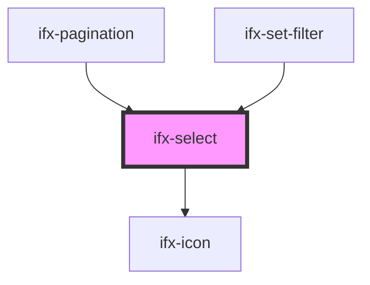

# choicesjs-stencil

<!-- Auto Generated Below -->

## Properties

| Property                    | Attribute                  | Description                                          | Type                                                                                                                                                                                                                                                                                                                                                                                                                                                                                                                                                                          | Default           |
| --------------------------- | -------------------------- | ---------------------------------------------------- | ----------------------------------------------------------------------------------------------------------------------------------------------------------------------------------------------------------------------------------------------------------------------------------------------------------------------------------------------------------------------------------------------------------------------------------------------------------------------------------------------------------------------------------------------------------------------------- | ----------------- |
| `addItemFilter`             | `add-item-filter`          | Filter for adding custom items.                      | `((value: string) => boolean) \| RegExp \| string`                                                                                                                                                                                                                                                                                                                                                                                                                                                                                                                            | `undefined`       |
| `addItemText`               | `add-item-text`            | Text for adding items.                               | `((value: string) => string) \| string`                                                                                                                                                                                                                                                                                                                                                                                                                                                                                                                                       | `undefined`       |
| `addItems`                  | `add-items`                | Whether new items can be added.                      | `boolean`                                                                                                                                                                                                                                                                                                                                                                                                                                                                                                                                                                     | `undefined`       |
| `appendValue`               | `append-value`             | Value to append to selected items.                   | `string`                                                                                                                                                                                                                                                                                                                                                                                                                                                                                                                                                                      | `undefined`       |
| `callbackOnCreateTemplates` | --                         | Callback for creating custom templates.              | `(template: any) => any`                                                                                                                                                                                                                                                                                                                                                                                                                                                                                                                                                      | `undefined`       |
| `callbackOnInit`            | --                         | Callback on initialization.                          | `() => void`                                                                                                                                                                                                                                                                                                                                                                                                                                                                                                                                                                  | `undefined`       |
| `caption`                   | `caption`                  | Caption text below the select.                       | `string`                                                                                                                                                                                                                                                                                                                                                                                                                                                                                                                                                                      | `""`              |
| `choices`                   | `choices`                  | Array or string of choices to populate the dropdown. | `any[] \| string`                                                                                                                                                                                                                                                                                                                                                                                                                                                                                                                                                             | `undefined`       |
| `classNames`                | --                         | Custom CSS class names.                              | `{ containerOuter?: string; containerInner?: string; input?: string; inputCloned?: string; list?: string; listItems?: string; listSingle?: string; listDropdown?: string; item?: string; itemSelectable?: string; itemDisabled?: string; itemChoice?: string; placeholder?: string; group?: string; groupHeading?: string; button?: string; activeState?: string; focusState?: string; openState?: string; disabledState?: string; highlightedState?: string; selectedState: string; flippedState?: string; loadingState?: string; noResults?: string; noChoices?: string; }` | `undefined`       |
| `customAddItemText`         | `custom-add-item-text`     | Custom text for adding items.                        | `((value: string) => string) \| string`                                                                                                                                                                                                                                                                                                                                                                                                                                                                                                                                       | `undefined`       |
| `delimiter`                 | `delimiter`                | Delimiter for splitting values.                      | `string`                                                                                                                                                                                                                                                                                                                                                                                                                                                                                                                                                                      | `undefined`       |
| `disabled`                  | `disabled`                 | Whether the select is disabled.                      | `boolean`                                                                                                                                                                                                                                                                                                                                                                                                                                                                                                                                                                     | `false`           |
| `duplicateItemsAllowed`     | `duplicate-items-allowed`  | Whether duplicate items are allowed.                 | `boolean`                                                                                                                                                                                                                                                                                                                                                                                                                                                                                                                                                                     | `undefined`       |
| `editItems`                 | `edit-items`               | Whether items can be edited.                         | `boolean`                                                                                                                                                                                                                                                                                                                                                                                                                                                                                                                                                                     | `undefined`       |
| `error`                     | `error`                    | Whether the select is in error state.                | `boolean`                                                                                                                                                                                                                                                                                                                                                                                                                                                                                                                                                                     | `false`           |
| `fuseOptions`               | --                         | Fuse.js search options.                              | `{ id?: string; caseSensitive?: boolean; includeMatches?: boolean; includeScore?: boolean; shouldSort?: boolean; keys?: string[] \| object[] \| WeightedField[]; verbose?: boolean; tokenize?: boolean; tokenSeparator?: RegExp; matchAllTokens?: boolean; location?: number; distance?: number; threshold?: number; maxPatternLength?: number; minMatchCharLength?: number; findAllMatches?: boolean; sortFn?(a: { score: number; }, b: { score: number; }): number; getFn?(obj: any, path: string): any; }`                                                                 | `undefined`       |
| `itemSelectText`            | `item-select-text`         | Text for item selection.                             | `""`                                                                                                                                                                                                                                                                                                                                                                                                                                                                                                                                                                          | `undefined`       |
| `items`                     | --                         | Array of items to be added.                          | `any[]`                                                                                                                                                                                                                                                                                                                                                                                                                                                                                                                                                                       | `undefined`       |
| `label`                     | `label`                    | Label text for the select.                           | `string`                                                                                                                                                                                                                                                                                                                                                                                                                                                                                                                                                                      | `""`              |
| `loadingText`               | `loading-text`             | Text shown during loading.                           | `string`                                                                                                                                                                                                                                                                                                                                                                                                                                                                                                                                                                      | `undefined`       |
| `maxItemCount`              | `max-item-count`           | Maximum number of items that can be selected.        | `number`                                                                                                                                                                                                                                                                                                                                                                                                                                                                                                                                                                      | `undefined`       |
| `maxItemText`               | `max-item-text`            | Text shown when max items reached.                   | `((maxItemCount: number) => string) \| string`                                                                                                                                                                                                                                                                                                                                                                                                                                                                                                                                | `undefined`       |
| `name`                      | `name`                     | The name attribute for the select element.           | `string`                                                                                                                                                                                                                                                                                                                                                                                                                                                                                                                                                                      | `undefined`       |
| `noChoicesText`             | `no-choices-text`          | Text shown when no choices available.                | `(() => string) \| string`                                                                                                                                                                                                                                                                                                                                                                                                                                                                                                                                                    | `undefined`       |
| `noResultsText`             | `no-results-text`          | Text shown when no results found.                    | `(() => string) \| string`                                                                                                                                                                                                                                                                                                                                                                                                                                                                                                                                                    | `undefined`       |
| `options`                   | `options`                  | Available options for the select.                    | `any[] \| string`                                                                                                                                                                                                                                                                                                                                                                                                                                                                                                                                                             | `undefined`       |
| `paste`                     | `paste`                    | Whether paste is enabled.                            | `boolean`                                                                                                                                                                                                                                                                                                                                                                                                                                                                                                                                                                     | `undefined`       |
| `placeholder`               | `placeholder`              | Placeholder text or boolean to enable/disable.       | `boolean \| string`                                                                                                                                                                                                                                                                                                                                                                                                                                                                                                                                                           | `undefined`       |
| `placeholderValue`          | `placeholder-value`        | Placeholder text value.                              | `string`                                                                                                                                                                                                                                                                                                                                                                                                                                                                                                                                                                      | `"Placeholder"`   |
| `position`                  | `position`                 | Position of the dropdown.                            | `"auto" \| "bottom" \| "top"`                                                                                                                                                                                                                                                                                                                                                                                                                                                                                                                                                 | `undefined`       |
| `prependValue`              | `prepend-value`            | Value to prepend to selected items.                  | `string`                                                                                                                                                                                                                                                                                                                                                                                                                                                                                                                                                                      | `undefined`       |
| `removeItemButton`          | `remove-item-button`       | Whether to show remove button on items.              | `boolean`                                                                                                                                                                                                                                                                                                                                                                                                                                                                                                                                                                     | `undefined`       |
| `removeItems`               | `remove-items`             | Whether items can be removed.                        | `boolean`                                                                                                                                                                                                                                                                                                                                                                                                                                                                                                                                                                     | `undefined`       |
| `renderChoiceLimit`         | `render-choice-limit`      | Maximum number of choices to render.                 | `number`                                                                                                                                                                                                                                                                                                                                                                                                                                                                                                                                                                      | `undefined`       |
| `renderSelectedChoices`     | `render-selected-choices`  | When to render selected choices.                     | `"always" \| "auto"`                                                                                                                                                                                                                                                                                                                                                                                                                                                                                                                                                          | `undefined`       |
| `required`                  | `required`                 | Whether the select is required.                      | `boolean`                                                                                                                                                                                                                                                                                                                                                                                                                                                                                                                                                                     | `false`           |
| `resetScrollPosition`       | `reset-scroll-position`    | Whether to reset scroll position on open.            | `boolean`                                                                                                                                                                                                                                                                                                                                                                                                                                                                                                                                                                     | `undefined`       |
| `searchChoices`             | `search-choices`           | Whether to enable search functionality.              | `boolean`                                                                                                                                                                                                                                                                                                                                                                                                                                                                                                                                                                     | `undefined`       |
| `searchFields`              | `search-fields`            | Fields to search within.                             | `string \| string[]`                                                                                                                                                                                                                                                                                                                                                                                                                                                                                                                                                          | `undefined`       |
| `searchFloor`               | `search-floor`             | Minimum characters before search activates.          | `number`                                                                                                                                                                                                                                                                                                                                                                                                                                                                                                                                                                      | `undefined`       |
| `searchPlaceholderValue`    | `search-placeholder-value` | Placeholder text for search input.                   | `string`                                                                                                                                                                                                                                                                                                                                                                                                                                                                                                                                                                      | `undefined`       |
| `searchResultLimit`         | `search-result-limit`      | Maximum number of search results.                    | `number`                                                                                                                                                                                                                                                                                                                                                                                                                                                                                                                                                                      | `undefined`       |
| `shouldSort`                | `should-sort`              | Whether choices should be sorted.                    | `boolean`                                                                                                                                                                                                                                                                                                                                                                                                                                                                                                                                                                     | `undefined`       |
| `shouldSortItems`           | `should-sort-items`        | Whether items should be sorted.                      | `boolean`                                                                                                                                                                                                                                                                                                                                                                                                                                                                                                                                                                     | `undefined`       |
| `showClearButton`           | `show-clear-button`        | Whether to show the clear button.                    | `boolean`                                                                                                                                                                                                                                                                                                                                                                                                                                                                                                                                                                     | `true`            |
| `showSearch`                | `show-search`              | Whether to show search input.                        | `boolean`                                                                                                                                                                                                                                                                                                                                                                                                                                                                                                                                                                     | `undefined`       |
| `size`                      | `size`                     | Size of the select component.                        | `string`                                                                                                                                                                                                                                                                                                                                                                                                                                                                                                                                                                      | `"medium (40px)"` |
| `sorter`                    | --                         | Custom sort function.                                | `(el1: any, el2: any) => number`                                                                                                                                                                                                                                                                                                                                                                                                                                                                                                                                              | `undefined`       |
| `uniqueItemText`            | `unique-item-text`         | Text for unique item validation.                     | `((value: string) => string) \| string`                                                                                                                                                                                                                                                                                                                                                                                                                                                                                                                                       | `undefined`       |
| `value`                     | `value`                    | The initial selected value.                          | `string`                                                                                                                                                                                                                                                                                                                                                                                                                                                                                                                                                                      | `undefined`       |
| `valueComparer`             | --                         | Function to compare values.                          | `(value1: string, value2: string) => boolean`                                                                                                                                                                                                                                                                                                                                                                                                                                                                                                                                 | `undefined`       |

## Events

| Event       | Description                     | Type                            |
| ----------- | ------------------------------- | ------------------------------- |
| `ifxInput`  | Emitted on input/search.        | `CustomEvent<CustomEvent<any>>` |
| `ifxSelect` | Emitted when selection changes. | `CustomEvent<CustomEvent<any>>` |

## Methods

### `ajax(fn: AjaxFn) => Promise<this>`

Performs an AJAX request.

#### Parameters

| Name | Type                      | Description |
| ---- | ------------------------- | ----------- |
| `fn` | `(callback: any) => void` |             |

#### Returns

Type: `Promise<this>`

### `clearChoices() => Promise<this>`

Clears all choices from the dropdown.

#### Returns

Type: `Promise<this>`

### `clearInput() => Promise<this>`

Clears the input field.

#### Returns

Type: `Promise<this>`

### `clearSelection() => Promise<void>`

Clears the current selection and resets the select field.

#### Returns

Type: `Promise<void>`

### `clearStore() => Promise<this>`

Clears the internal store.

#### Returns

Type: `Promise<this>`

### `getValue(valueOnly?: boolean) => Promise<string | Array<string>>`

Gets the current selected value(s).

#### Parameters

| Name        | Type      | Description |
| ----------- | --------- | ----------- |
| `valueOnly` | `boolean` |             |

#### Returns

Type: `Promise<string | string[]>`

### `handleChange() => Promise<void>`

Handles selection change and emits the selected value.

#### Returns

Type: `Promise<void>`

### `handleDeleteIcon() => Promise<void>`

Toggles visibility of the delete icon based on component width.

#### Returns

Type: `Promise<void>`

### `hideDropdown(blurInput?: boolean) => Promise<this>`

Hides the dropdown menu.

#### Parameters

| Name        | Type      | Description |
| ----------- | --------- | ----------- |
| `blurInput` | `boolean` |             |

#### Returns

Type: `Promise<this>`

### `highlightAll() => Promise<this>`

Highlights all items in the dropdown.

#### Returns

Type: `Promise<this>`

### `highlightItem(item: HTMLElement, runEvent?: boolean) => Promise<this>`

Highlights a specific item in the dropdown.

#### Parameters

| Name       | Type          | Description |
| ---------- | ------------- | ----------- |
| `item`     | `HTMLElement` |             |
| `runEvent` | `boolean`     |             |

#### Returns

Type: `Promise<this>`

### `removeActiveItems(excludedId?: number) => Promise<this>`

Removes all active items except the excluded one.

#### Parameters

| Name         | Type     | Description |
| ------------ | -------- | ----------- |
| `excludedId` | `number` |             |

#### Returns

Type: `Promise<this>`

### `removeActiveItemsByValue(value: string) => Promise<this>`

Removes active items by their value.

#### Parameters

| Name    | Type     | Description |
| ------- | -------- | ----------- |
| `value` | `string` |             |

#### Returns

Type: `Promise<this>`

### `removeHighlightedItems(runEvent?: boolean) => Promise<this>`

Removes all highlighted items.

#### Parameters

| Name       | Type      | Description |
| ---------- | --------- | ----------- |
| `runEvent` | `boolean` |             |

#### Returns

Type: `Promise<this>`

### `setChoiceByValue(value: string | Array<string>) => Promise<this>`

Sets the selected choice by value.

#### Parameters

| Name    | Type                 | Description |
| ------- | -------------------- | ----------- |
| `value` | `string \| string[]` |             |

#### Returns

Type: `Promise<this>`

### `setChoices(choices: any[] | string, value: string, label: string, replaceChoices?: boolean) => Promise<this>`

Sets the available choices/options.

#### Parameters

| Name             | Type              | Description |
| ---------------- | ----------------- | ----------- |
| `choices`        | `string \| any[]` |             |
| `value`          | `string`          |             |
| `label`          | `string`          |             |
| `replaceChoices` | `boolean`         |             |

#### Returns

Type: `Promise<this>`

### `setValue(args: Array<any>) => Promise<this>`

Sets the selected value(s).

#### Parameters

| Name   | Type    | Description |
| ------ | ------- | ----------- |
| `args` | `any[]` |             |

#### Returns

Type: `Promise<this>`

### `showDropdown(focusInput?: boolean) => Promise<this>`

Shows the dropdown menu.

#### Parameters

| Name         | Type      | Description |
| ------------ | --------- | ----------- |
| `focusInput` | `boolean` |             |

#### Returns

Type: `Promise<this>`

### `unhighlightAll() => Promise<this>`

Removes highlight from all items.

#### Returns

Type: `Promise<this>`

### `unhighlightItem(item: HTMLElement) => Promise<this>`

Removes highlight from a specific item.

#### Parameters

| Name   | Type          | Description |
| ------ | ------------- | ----------- |
| `item` | `HTMLElement` |             |

#### Returns

Type: `Promise<this>`

## Dependencies

### Used by

 - [ifx-pagination](../../pagination)
 - [ifx-set-filter](../../table-advanced-version/set-filter)

### Depends on

- [ifx-icon](../../icon)

### Graph

----------------------------------------------

*Built with [StencilJS](https://stenciljs.com/)*
