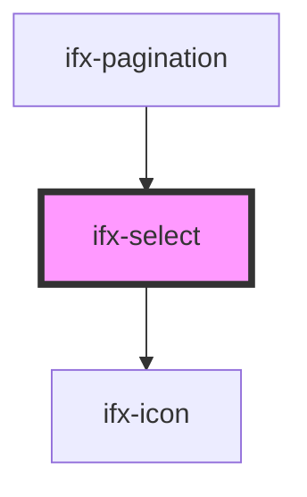

# choicesjs-stencil

<!-- Auto Generated Below -->

## Properties

| Property                    | Attribute                  | Description | Type                                                                                                                                                                                                                                                                                                                                                                                                                                                                                                                                                                          | Default           |
| --------------------------- | -------------------------- | ----------- | ----------------------------------------------------------------------------------------------------------------------------------------------------------------------------------------------------------------------------------------------------------------------------------------------------------------------------------------------------------------------------------------------------------------------------------------------------------------------------------------------------------------------------------------------------------------------------- | ----------------- |
| `addItemFilter`             | `add-item-filter`          |             | `((value: string) => boolean) \| RegExp \| string`                                                                                                                                                                                                                                                                                                                                                                                                                                                                                                                            | `undefined`       |
| `addItemText`               | `add-item-text`            |             | `((value: string) => string) \| string`                                                                                                                                                                                                                                                                                                                                                                                                                                                                                                                                       | `undefined`       |
| `addItems`                  | `add-items`                |             | `boolean`                                                                                                                                                                                                                                                                                                                                                                                                                                                                                                                                                                     | `undefined`       |
| `appendValue`               | `append-value`             |             | `string`                                                                                                                                                                                                                                                                                                                                                                                                                                                                                                                                                                      | `undefined`       |
| `callbackOnCreateTemplates` | --                         |             | `(template: any) => any`                                                                                                                                                                                                                                                                                                                                                                                                                                                                                                                                                      | `undefined`       |
| `callbackOnInit`            | --                         |             | `() => void`                                                                                                                                                                                                                                                                                                                                                                                                                                                                                                                                                                  | `undefined`       |
| `choices`                   | `choices`                  |             | `any[] \| string`                                                                                                                                                                                                                                                                                                                                                                                                                                                                                                                                                             | `undefined`       |
| `classNames`                | --                         |             | `{ containerOuter?: string; containerInner?: string; input?: string; inputCloned?: string; list?: string; listItems?: string; listSingle?: string; listDropdown?: string; item?: string; itemSelectable?: string; itemDisabled?: string; itemChoice?: string; placeholder?: string; group?: string; groupHeading?: string; button?: string; activeState?: string; focusState?: string; openState?: string; disabledState?: string; highlightedState?: string; selectedState: string; flippedState?: string; loadingState?: string; noResults?: string; noChoices?: string; }` | `undefined`       |
| `customAddItemText`         | `custom-add-item-text`     |             | `((value: string) => string) \| string`                                                                                                                                                                                                                                                                                                                                                                                                                                                                                                                                       | `undefined`       |
| `delimiter`                 | `delimiter`                |             | `string`                                                                                                                                                                                                                                                                                                                                                                                                                                                                                                                                                                      | `undefined`       |
| `disabled`                  | `disabled`                 |             | `boolean`                                                                                                                                                                                                                                                                                                                                                                                                                                                                                                                                                                     | `false`           |
| `duplicateItemsAllowed`     | `duplicate-items-allowed`  |             | `boolean`                                                                                                                                                                                                                                                                                                                                                                                                                                                                                                                                                                     | `undefined`       |
| `editItems`                 | `edit-items`               |             | `boolean`                                                                                                                                                                                                                                                                                                                                                                                                                                                                                                                                                                     | `undefined`       |
| `error`                     | `error`                    |             | `boolean`                                                                                                                                                                                                                                                                                                                                                                                                                                                                                                                                                                     | `false`           |
| `errorMessage`              | `error-message`            |             | `string`                                                                                                                                                                                                                                                                                                                                                                                                                                                                                                                                                                      | `"Error"`         |
| `fuseOptions`               | --                         |             | `{ id?: string; caseSensitive?: boolean; includeMatches?: boolean; includeScore?: boolean; shouldSort?: boolean; keys?: string[] \| object[] \| WeightedField[]; verbose?: boolean; tokenize?: boolean; tokenSeparator?: RegExp; matchAllTokens?: boolean; location?: number; distance?: number; threshold?: number; maxPatternLength?: number; minMatchCharLength?: number; findAllMatches?: boolean; sortFn?(a: { score: number; }, b: { score: number; }): number; getFn?(obj: any, path: string): any; }`                                                                 | `undefined`       |
| `itemSelectText`            | `item-select-text`         |             | `""`                                                                                                                                                                                                                                                                                                                                                                                                                                                                                                                                                                          | `undefined`       |
| `items`                     | --                         |             | `any[]`                                                                                                                                                                                                                                                                                                                                                                                                                                                                                                                                                                       | `undefined`       |
| `label`                     | `label`                    |             | `string`                                                                                                                                                                                                                                                                                                                                                                                                                                                                                                                                                                      | `""`              |
| `loadingText`               | `loading-text`             |             | `string`                                                                                                                                                                                                                                                                                                                                                                                                                                                                                                                                                                      | `undefined`       |
| `maxItemCount`              | `max-item-count`           |             | `number`                                                                                                                                                                                                                                                                                                                                                                                                                                                                                                                                                                      | `undefined`       |
| `maxItemText`               | `max-item-text`            |             | `((maxItemCount: number) => string) \| string`                                                                                                                                                                                                                                                                                                                                                                                                                                                                                                                                | `undefined`       |
| `name`                      | `name`                     |             | `string`                                                                                                                                                                                                                                                                                                                                                                                                                                                                                                                                                                      | `undefined`       |
| `noChoicesText`             | `no-choices-text`          |             | `(() => string) \| string`                                                                                                                                                                                                                                                                                                                                                                                                                                                                                                                                                    | `undefined`       |
| `noResultsText`             | `no-results-text`          |             | `(() => string) \| string`                                                                                                                                                                                                                                                                                                                                                                                                                                                                                                                                                    | `undefined`       |
| `options`                   | `options`                  |             | `any[] \| string`                                                                                                                                                                                                                                                                                                                                                                                                                                                                                                                                                             | `undefined`       |
| `paste`                     | `paste`                    |             | `boolean`                                                                                                                                                                                                                                                                                                                                                                                                                                                                                                                                                                     | `undefined`       |
| `placeholder`               | `placeholder`              |             | `boolean \| string`                                                                                                                                                                                                                                                                                                                                                                                                                                                                                                                                                           | `undefined`       |
| `placeholderValue`          | `placeholder-value`        |             | `string`                                                                                                                                                                                                                                                                                                                                                                                                                                                                                                                                                                      | `"Placeholder"`   |
| `position`                  | `position`                 |             | `"auto" \| "bottom" \| "top"`                                                                                                                                                                                                                                                                                                                                                                                                                                                                                                                                                 | `undefined`       |
| `prependValue`              | `prepend-value`            |             | `string`                                                                                                                                                                                                                                                                                                                                                                                                                                                                                                                                                                      | `undefined`       |
| `removeItemButton`          | `remove-item-button`       |             | `boolean`                                                                                                                                                                                                                                                                                                                                                                                                                                                                                                                                                                     | `undefined`       |
| `removeItems`               | `remove-items`             |             | `boolean`                                                                                                                                                                                                                                                                                                                                                                                                                                                                                                                                                                     | `undefined`       |
| `renderChoiceLimit`         | `render-choice-limit`      |             | `number`                                                                                                                                                                                                                                                                                                                                                                                                                                                                                                                                                                      | `undefined`       |
| `renderSelectedChoices`     | `render-selected-choices`  |             | `"always" \| "auto"`                                                                                                                                                                                                                                                                                                                                                                                                                                                                                                                                                          | `undefined`       |
| `resetScrollPosition`       | `reset-scroll-position`    |             | `boolean`                                                                                                                                                                                                                                                                                                                                                                                                                                                                                                                                                                     | `undefined`       |
| `searchChoices`             | `search-choices`           |             | `boolean`                                                                                                                                                                                                                                                                                                                                                                                                                                                                                                                                                                     | `undefined`       |
| `searchEnabled`             | `search-enabled`           |             | `boolean`                                                                                                                                                                                                                                                                                                                                                                                                                                                                                                                                                                     | `undefined`       |
| `searchFields`              | `search-fields`            |             | `string \| string[]`                                                                                                                                                                                                                                                                                                                                                                                                                                                                                                                                                          | `undefined`       |
| `searchFloor`               | `search-floor`             |             | `number`                                                                                                                                                                                                                                                                                                                                                                                                                                                                                                                                                                      | `undefined`       |
| `searchPlaceholderValue`    | `search-placeholder-value` |             | `string`                                                                                                                                                                                                                                                                                                                                                                                                                                                                                                                                                                      | `undefined`       |
| `searchResultLimit`         | `search-result-limit`      |             | `number`                                                                                                                                                                                                                                                                                                                                                                                                                                                                                                                                                                      | `undefined`       |
| `shouldSort`                | `should-sort`              |             | `boolean`                                                                                                                                                                                                                                                                                                                                                                                                                                                                                                                                                                     | `undefined`       |
| `shouldSortItems`           | `should-sort-items`        |             | `boolean`                                                                                                                                                                                                                                                                                                                                                                                                                                                                                                                                                                     | `undefined`       |
| `size`                      | `size`                     |             | `string`                                                                                                                                                                                                                                                                                                                                                                                                                                                                                                                                                                      | `'medium (40px)'` |
| `sorter`                    | --                         |             | `(el1: any, el2: any) => number`                                                                                                                                                                                                                                                                                                                                                                                                                                                                                                                                              | `undefined`       |
| `type`                      | `type`                     |             | `string`                                                                                                                                                                                                                                                                                                                                                                                                                                                                                                                                                                      | `'single'`        |
| `uniqueItemText`            | `unique-item-text`         |             | `((value: string) => string) \| string`                                                                                                                                                                                                                                                                                                                                                                                                                                                                                                                                       | `undefined`       |
| `value`                     | `value`                    |             | `string`                                                                                                                                                                                                                                                                                                                                                                                                                                                                                                                                                                      | `undefined`       |
| `valueComparer`             | --                         |             | `(value1: string, value2: string) => boolean`                                                                                                                                                                                                                                                                                                                                                                                                                                                                                                                                 | `undefined`       |

## Events

| Event       | Description | Type                            |
| ----------- | ----------- | ------------------------------- |
| `ifxInput`  |             | `CustomEvent<CustomEvent<any>>` |
| `ifxSelect` |             | `CustomEvent<CustomEvent<any>>` |

## Methods

### `ajax(fn: AjaxFn) => Promise<this>`

#### Parameters

| Name | Type                      | Description |
| ---- | ------------------------- | ----------- |
| `fn` | `(callback: any) => void` |             |

#### Returns

Type: `Promise<this>`

### `clearChoices() => Promise<this>`

#### Returns

Type: `Promise<this>`

### `clearInput() => Promise<this>`

#### Returns

Type: `Promise<this>`

### `clearStore() => Promise<this>`

#### Returns

Type: `Promise<this>`

### `disable() => Promise<this>`

#### Returns

Type: `Promise<this>`

### `enable() => Promise<this>`

#### Returns

Type: `Promise<this>`

### `getValue(valueOnly?: boolean) => Promise<string | Array<string>>`

#### Parameters

| Name        | Type      | Description |
| ----------- | --------- | ----------- |
| `valueOnly` | `boolean` |             |

#### Returns

Type: `Promise<string | string[]>`

### `handleChange() => Promise<void>`

#### Returns

Type: `Promise<void>`

### `hideDropdown(blurInput?: boolean) => Promise<this>`

#### Parameters

| Name        | Type      | Description |
| ----------- | --------- | ----------- |
| `blurInput` | `boolean` |             |

#### Returns

Type: `Promise<this>`

### `highlightAll() => Promise<this>`

#### Returns

Type: `Promise<this>`

### `highlightItem(item: HTMLElement, runEvent?: boolean) => Promise<this>`

#### Parameters

| Name       | Type          | Description |
| ---------- | ------------- | ----------- |
| `item`     | `HTMLElement` |             |
| `runEvent` | `boolean`     |             |

#### Returns

Type: `Promise<this>`

### `removeActiveItems(excludedId?: number) => Promise<this>`

#### Parameters

| Name         | Type     | Description |
| ------------ | -------- | ----------- |
| `excludedId` | `number` |             |

#### Returns

Type: `Promise<this>`

### `removeActiveItemsByValue(value: string) => Promise<this>`

#### Parameters

| Name    | Type     | Description |
| ------- | -------- | ----------- |
| `value` | `string` |             |

#### Returns

Type: `Promise<this>`

### `removeHighlightedItems(runEvent?: boolean) => Promise<this>`

#### Parameters

| Name       | Type      | Description |
| ---------- | --------- | ----------- |
| `runEvent` | `boolean` |             |

#### Returns

Type: `Promise<this>`

### `setChoiceByValue(value: string | Array<string>) => Promise<this>`

#### Parameters

| Name    | Type                 | Description |
| ------- | -------------------- | ----------- |
| `value` | `string \| string[]` |             |

#### Returns

Type: `Promise<this>`

### `setChoices(choices: any[] | string, value: string, label: string, replaceChoices?: boolean) => Promise<this>`

#### Parameters

| Name             | Type              | Description |
| ---------------- | ----------------- | ----------- |
| `choices`        | `string \| any[]` |             |
| `value`          | `string`          |             |
| `label`          | `string`          |             |
| `replaceChoices` | `boolean`         |             |

#### Returns

Type: `Promise<this>`

### `setValue(args: Array<any>) => Promise<this>`

#### Parameters

| Name   | Type    | Description |
| ------ | ------- | ----------- |
| `args` | `any[]` |             |

#### Returns

Type: `Promise<this>`

### `showDropdown(focusInput?: boolean) => Promise<this>`

#### Parameters

| Name         | Type      | Description |
| ------------ | --------- | ----------- |
| `focusInput` | `boolean` |             |

#### Returns

Type: `Promise<this>`

### `unhighlightAll() => Promise<this>`

#### Returns

Type: `Promise<this>`

### `unhighlightItem(item: HTMLElement) => Promise<this>`

#### Parameters

| Name   | Type          | Description |
| ------ | ------------- | ----------- |
| `item` | `HTMLElement` |             |

#### Returns

Type: `Promise<this>`

## Dependencies

### Used by

 - [ifx-pagination](../../pagination)

### Depends on

- [ifx-icon](../../icon)

### Graph

----------------------------------------------

*Built with [StencilJS](https://stenciljs.com/)*
