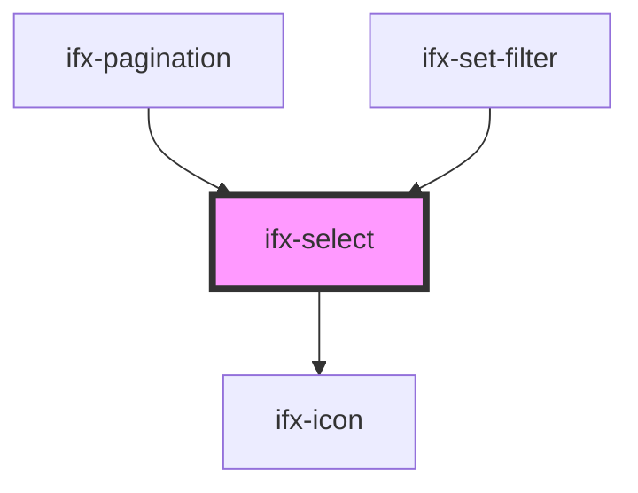

# choicesjs-stencil

<!-- Auto Generated Below -->

## Properties

| Property                    | Attribute                  | Description                                                              | Type                                                                                                                                                                                                                                                                                                                                                                                                                                                                                                                                                                          | Default           |
| --------------------------- | -------------------------- | ------------------------------------------------------------------------ | ----------------------------------------------------------------------------------------------------------------------------------------------------------------------------------------------------------------------------------------------------------------------------------------------------------------------------------------------------------------------------------------------------------------------------------------------------------------------------------------------------------------------------------------------------------------------------- | ----------------- |
| `addItemFilter`             | `add-item-filter`          | Filter used to validate items before they are added.                     | `((value: string) => boolean) \| RegExp \| string`                                                                                                                                                                                                                                                                                                                                                                                                                                                                                                                            | `undefined`       |
| `addItemText`               | `add-item-text`            | Text or function for the “add item” prompt.                              | `((value: string) => string) \| string`                                                                                                                                                                                                                                                                                                                                                                                                                                                                                                                                       | `undefined`       |
| `addItems`                  | `add-items`                | Whether new items can be added by the user.                              | `boolean`                                                                                                                                                                                                                                                                                                                                                                                                                                                                                                                                                                     | `undefined`       |
| `appendValue`               | `append-value`             | Text to append to each item’s value on output.                           | `string`                                                                                                                                                                                                                                                                                                                                                                                                                                                                                                                                                                      | `undefined`       |
| `callbackOnCreateTemplates` | --                         | Callback used to create or override internal templates.                  | `(template: any) => any`                                                                                                                                                                                                                                                                                                                                                                                                                                                                                                                                                      | `undefined`       |
| `callbackOnInit`            | --                         | Callback function invoked when the Choices instance is initialized.      | `() => void`                                                                                                                                                                                                                                                                                                                                                                                                                                                                                                                                                                  | `undefined`       |
| `caption`                   | `caption`                  | Helper text shown below the select field.                                | `string`                                                                                                                                                                                                                                                                                                                                                                                                                                                                                                                                                                      | `""`              |
| `choices`                   | `choices`                  | Available choices; can be an array or a string (e.g. data source).       | `any[] \| string`                                                                                                                                                                                                                                                                                                                                                                                                                                                                                                                                                             | `undefined`       |
| `classNames`                | --                         | Custom CSS class names mapping for internal elements.                    | `{ containerOuter?: string; containerInner?: string; input?: string; inputCloned?: string; list?: string; listItems?: string; listSingle?: string; listDropdown?: string; item?: string; itemSelectable?: string; itemDisabled?: string; itemChoice?: string; placeholder?: string; group?: string; groupHeading?: string; button?: string; activeState?: string; focusState?: string; openState?: string; disabledState?: string; highlightedState?: string; selectedState: string; flippedState?: string; loadingState?: string; noResults?: string; noChoices?: string; }` | `undefined`       |
| `customAddItemText`         | `custom-add-item-text`     | Configuration for customizing the “add item” text.                       | `((value: string) => string) \| string`                                                                                                                                                                                                                                                                                                                                                                                                                                                                                                                                       | `undefined`       |
| `delimiter`                 | `delimiter`                | Delimiter used when parsing or joining item values (e.g. for paste).     | `string`                                                                                                                                                                                                                                                                                                                                                                                                                                                                                                                                                                      | `undefined`       |
| `disabled`                  | `disabled`                 | If true, the select is disabled and not interactive.                     | `boolean`                                                                                                                                                                                                                                                                                                                                                                                                                                                                                                                                                                     | `false`           |
| `duplicateItemsAllowed`     | `duplicate-items-allowed`  | Whether duplicate items are allowed.                                     | `boolean`                                                                                                                                                                                                                                                                                                                                                                                                                                                                                                                                                                     | `undefined`       |
| `editItems`                 | `edit-items`               | Whether selected items can be edited in place.                           | `boolean`                                                                                                                                                                                                                                                                                                                                                                                                                                                                                                                                                                     | `undefined`       |
| `error`                     | `error`                    | If true, shows the select in an error state.                             | `boolean`                                                                                                                                                                                                                                                                                                                                                                                                                                                                                                                                                                     | `false`           |
| `fuseOptions`               | --                         | Fuse.js options for fuzzy searching choices.                             | `{ id?: string; caseSensitive?: boolean; includeMatches?: boolean; includeScore?: boolean; shouldSort?: boolean; keys?: string[] \| object[] \| WeightedField[]; verbose?: boolean; tokenize?: boolean; tokenSeparator?: RegExp; matchAllTokens?: boolean; location?: number; distance?: number; threshold?: number; maxPatternLength?: number; minMatchCharLength?: number; findAllMatches?: boolean; sortFn?(a: { score: number; }, b: { score: number; }): number; getFn?(obj: any, path: string): any; }`                                                                 | `undefined`       |
| `itemSelectText`            | `item-select-text`         | Text shown on an item when it is selectable (kept as empty string here). | `""`                                                                                                                                                                                                                                                                                                                                                                                                                                                                                                                                                                          | `undefined`       |
| `items`                     | --                         | Initial list of items to populate the component with.                    | `any[]`                                                                                                                                                                                                                                                                                                                                                                                                                                                                                                                                                                       | `undefined`       |
| `label`                     | `label`                    | Label text shown above the select field.                                 | `string`                                                                                                                                                                                                                                                                                                                                                                                                                                                                                                                                                                      | `""`              |
| `loadingText`               | `loading-text`             | Text shown while data or choices are loading.                            | `string`                                                                                                                                                                                                                                                                                                                                                                                                                                                                                                                                                                      | `undefined`       |
| `maxItemCount`              | `max-item-count`           | Maximum number of items that can be selected.                            | `number`                                                                                                                                                                                                                                                                                                                                                                                                                                                                                                                                                                      | `undefined`       |
| `maxItemText`               | `max-item-text`            | Text or function used when the max item count is reached.                | `((maxItemCount: number) => string) \| string`                                                                                                                                                                                                                                                                                                                                                                                                                                                                                                                                | `undefined`       |
| `name`                      | `name`                     | Name attribute used when submitting the field in a form.                 | `string`                                                                                                                                                                                                                                                                                                                                                                                                                                                                                                                                                                      | `undefined`       |
| `noChoicesText`             | `no-choices-text`          | Text or function used when there are no choices to show.                 | `(() => string) \| string`                                                                                                                                                                                                                                                                                                                                                                                                                                                                                                                                                    | `undefined`       |
| `noResultsText`             | `no-results-text`          | Text or function used when no search results are found.                  | `(() => string) \| string`                                                                                                                                                                                                                                                                                                                                                                                                                                                                                                                                                    | `undefined`       |
| `options`                   | `options`                  | List of available options (array or string source).                      | `any[] \| string`                                                                                                                                                                                                                                                                                                                                                                                                                                                                                                                                                             | `undefined`       |
| `paste`                     | `paste`                    | Whether pasting values to create items is allowed.                       | `boolean`                                                                                                                                                                                                                                                                                                                                                                                                                                                                                                                                                                     | `undefined`       |
| `placeholder`               | `placeholder`              | Placeholder configuration or text for the input.                         | `boolean \| string`                                                                                                                                                                                                                                                                                                                                                                                                                                                                                                                                                           | `undefined`       |
| `placeholderValue`          | `placeholder-value`        | Placeholder text shown when no option is selected.                       | `string`                                                                                                                                                                                                                                                                                                                                                                                                                                                                                                                                                                      | `"Placeholder"`   |
| `position`                  | `position`                 | Position of the dropdown relative to the input.                          | `"auto" \| "bottom" \| "top"`                                                                                                                                                                                                                                                                                                                                                                                                                                                                                                                                                 | `undefined`       |
| `prependValue`              | `prepend-value`            | Text to prepend to each item’s value on output.                          | `string`                                                                                                                                                                                                                                                                                                                                                                                                                                                                                                                                                                      | `undefined`       |
| `removeItemButton`          | `remove-item-button`       | Whether to show a remove button on each selected item.                   | `boolean`                                                                                                                                                                                                                                                                                                                                                                                                                                                                                                                                                                     | `undefined`       |
| `removeItems`               | `remove-items`             | Whether items can be removed by the user.                                | `boolean`                                                                                                                                                                                                                                                                                                                                                                                                                                                                                                                                                                     | `undefined`       |
| `renderChoiceLimit`         | `render-choice-limit`      | Maximum number of choices to render in the list at once.                 | `number`                                                                                                                                                                                                                                                                                                                                                                                                                                                                                                                                                                      | `undefined`       |
| `renderSelectedChoices`     | `render-selected-choices`  | When to render selected choices (always or only when needed).            | `"always" \| "auto"`                                                                                                                                                                                                                                                                                                                                                                                                                                                                                                                                                          | `undefined`       |
| `required`                  | `required`                 | Whether selecting a value is required.                                   | `boolean`                                                                                                                                                                                                                                                                                                                                                                                                                                                                                                                                                                     | `false`           |
| `resetScrollPosition`       | `reset-scroll-position`    | Whether to reset scroll position when opening the dropdown.              | `boolean`                                                                                                                                                                                                                                                                                                                                                                                                                                                                                                                                                                     | `undefined`       |
| `searchChoices`             | `search-choices`           | Whether search filters the available choices.                            | `boolean`                                                                                                                                                                                                                                                                                                                                                                                                                                                                                                                                                                     | `undefined`       |
| `searchFields`              | `search-fields`            | Fields used when searching choices (array of field names or a string).   | `string \| string[]`                                                                                                                                                                                                                                                                                                                                                                                                                                                                                                                                                          | `undefined`       |
| `searchFloor`               | `search-floor`             | Minimum number of characters before search is triggered.                 | `number`                                                                                                                                                                                                                                                                                                                                                                                                                                                                                                                                                                      | `undefined`       |
| `searchPlaceholderValue`    | `search-placeholder-value` | Placeholder text shown inside the search input.                          | `string`                                                                                                                                                                                                                                                                                                                                                                                                                                                                                                                                                                      | `undefined`       |
| `searchResultLimit`         | `search-result-limit`      | Maximum number of search results to display.                             | `number`                                                                                                                                                                                                                                                                                                                                                                                                                                                                                                                                                                      | `undefined`       |
| `shouldSort`                | `should-sort`              | Whether available choices should be sorted.                              | `boolean`                                                                                                                                                                                                                                                                                                                                                                                                                                                                                                                                                                     | `undefined`       |
| `shouldSortItems`           | `should-sort-items`        | Whether selected items should be sorted.                                 | `boolean`                                                                                                                                                                                                                                                                                                                                                                                                                                                                                                                                                                     | `undefined`       |
| `showClearButton`           | `show-clear-button`        | If true, shows a button to clear the current selection.                  | `boolean`                                                                                                                                                                                                                                                                                                                                                                                                                                                                                                                                                                     | `true`            |
| `showSearch`                | `show-search`              | Whether the search input is shown.                                       | `boolean`                                                                                                                                                                                                                                                                                                                                                                                                                                                                                                                                                                     | `undefined`       |
| `size`                      | `size`                     | Size of the select component (e.g. medium / 40px).                       | `string`                                                                                                                                                                                                                                                                                                                                                                                                                                                                                                                                                                      | `"medium (40px)"` |
| `sorter`                    | --                         | Custom sorting function for choices and/or items.                        | `(el1: any, el2: any) => number`                                                                                                                                                                                                                                                                                                                                                                                                                                                                                                                                              | `undefined`       |
| `uniqueItemText`            | `unique-item-text`         | Text configuration for duplicate/unique item errors.                     | `((value: string) => string) \| string`                                                                                                                                                                                                                                                                                                                                                                                                                                                                                                                                       | `undefined`       |
| `value`                     | `value`                    | Initial value of the Choices instance.                                   | `string`                                                                                                                                                                                                                                                                                                                                                                                                                                                                                                                                                                      | `undefined`       |
| `valueComparer`             | --                         | Custom function for comparing item/choice values.                        | `(value1: string, value2: string) => boolean`                                                                                                                                                                                                                                                                                                                                                                                                                                                                                                                                 | `undefined`       |

## Events

| Event       | Description                                  | Type                            |
| ----------- | -------------------------------------------- | ------------------------------- |
| `ifxInput`  | Fired when the input / search value changes. | `CustomEvent<CustomEvent<any>>` |
| `ifxSelect` | Fired when an option is selected.            | `CustomEvent<CustomEvent<any>>` |

## Methods

### `ajax(fn: AjaxFn) => Promise<this>`

Performs an AJAX request using the provided function.

#### Parameters

| Name | Type                      | Description |
| ---- | ------------------------- | ----------- |
| `fn` | `(callback: any) => void` |             |

#### Returns

Type: `Promise<this>`

### `clearChoices() => Promise<this>`

Removes all available choices from the dropdown.

#### Returns

Type: `Promise<this>`

### `clearInput() => Promise<this>`

Clears the text input value.

#### Returns

Type: `Promise<this>`

### `clearSelection() => Promise<void>`

Clears the current selection and closes the dropdown if not disabled.

#### Returns

Type: `Promise<void>`

### `clearStore() => Promise<this>`

Clears the internal Choices.js store.

#### Returns

Type: `Promise<this>`

### `getValue(valueOnly?: boolean) => Promise<string | Array<string>>`

Gets the current value(s); returns raw value or full item list.

#### Parameters

| Name        | Type      | Description |
| ----------- | --------- | ----------- |
| `valueOnly` | `boolean` |             |

#### Returns

Type: `Promise<string | string[]>`

### `handleChange(selectedOption: any) => Promise<void>`

Handles a selection change, updates state, and closes the dropdown.

#### Parameters

| Name             | Type  | Description |
| ---------------- | ----- | ----------- |
| `selectedOption` | `any` |             |

#### Returns

Type: `Promise<void>`

### `handleDeleteIcon() => Promise<void>`

Shows or hides the delete icon depending on component width and settings.

#### Returns

Type: `Promise<void>`

### `hideDropdown(blurInput?: boolean) => Promise<this>`

Closes the dropdown, optionally blurring the input.

#### Parameters

| Name        | Type      | Description |
| ----------- | --------- | ----------- |
| `blurInput` | `boolean` |             |

#### Returns

Type: `Promise<this>`

### `highlightAll() => Promise<this>`

Highlights all items.

#### Returns

Type: `Promise<this>`

### `highlightItem(item: HTMLElement, runEvent?: boolean) => Promise<this>`

Highlights a specific item in the dropdown.

#### Parameters

| Name       | Type          | Description |
| ---------- | ------------- | ----------- |
| `item`     | `HTMLElement` |             |
| `runEvent` | `boolean`     |             |

#### Returns

Type: `Promise<this>`

### `removeActiveItems(excludedId?: number) => Promise<this>`

Removes all active items, optionally excluding one by ID.

#### Parameters

| Name         | Type     | Description |
| ------------ | -------- | ----------- |
| `excludedId` | `number` |             |

#### Returns

Type: `Promise<this>`

### `removeActiveItemsByValue(value: string) => Promise<this>`

Removes active items that match a given value.

#### Parameters

| Name    | Type     | Description |
| ------- | -------- | ----------- |
| `value` | `string` |             |

#### Returns

Type: `Promise<this>`

### `removeHighlightedItems(runEvent?: boolean) => Promise<this>`

Removes all currently highlighted items.

#### Parameters

| Name       | Type      | Description |
| ---------- | --------- | ----------- |
| `runEvent` | `boolean` |             |

#### Returns

Type: `Promise<this>`

### `setChoiceByValue(value: string | Array<string>) => Promise<this>`

Selects choices that match the given value or values.

#### Parameters

| Name    | Type                 | Description |
| ------- | -------------------- | ----------- |
| `value` | `string \| string[]` |             |

#### Returns

Type: `Promise<this>`

### `setChoices(choices: any[] | string, value: string, label: string, replaceChoices?: boolean) => Promise<this>`

Sets the available choices from an array or JSON string.

#### Parameters

| Name             | Type              | Description |
| ---------------- | ----------------- | ----------- |
| `choices`        | `string \| any[]` |             |
| `value`          | `string`          |             |
| `label`          | `string`          |             |
| `replaceChoices` | `boolean`         |             |

#### Returns

Type: `Promise<this>`

### `setValue(args: Array<any>) => Promise<this>`

Sets the current value(s) programmatically.

#### Parameters

| Name   | Type    | Description |
| ------ | ------- | ----------- |
| `args` | `any[]` |             |

#### Returns

Type: `Promise<this>`

### `showDropdown(focusInput?: boolean) => Promise<this>`

Opens the dropdown, optionally focusing the input.

#### Parameters

| Name         | Type      | Description |
| ------------ | --------- | ----------- |
| `focusInput` | `boolean` |             |

#### Returns

Type: `Promise<this>`

### `unhighlightAll() => Promise<this>`

Removes highlight from all items.

#### Returns

Type: `Promise<this>`

### `unhighlightItem(item: HTMLElement) => Promise<this>`

Removes highlight from a specific item.

#### Parameters

| Name   | Type          | Description |
| ------ | ------------- | ----------- |
| `item` | `HTMLElement` |             |

#### Returns

Type: `Promise<this>`

## Dependencies

### Used by

 - [ifx-pagination](../../pagination)
 - [ifx-set-filter](../../table-advanced-version/set-filter)

### Depends on

- [ifx-icon](../../icon)

### Graph

```mermaid
graph TD;
  ifx-select --> ifx-icon
  ifx-pagination --> ifx-select
  ifx-set-filter --> ifx-select
  style ifx-select fill:#f9f,stroke:#333,stroke-width:4px
```

----------------------------------------------

*Built with [StencilJS](https://stenciljs.com/)*
