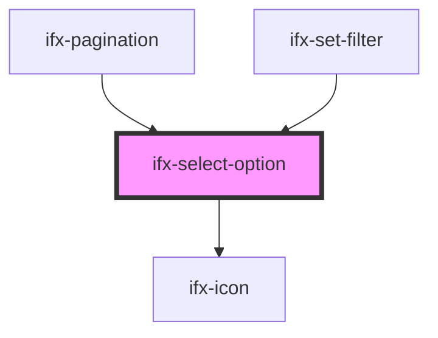

# choicesjs-stencil

<!-- Auto Generated Below -->

## Overview

A single selectable option inside an `ifx-select`. Provided as a slotted child
(optionally wrapped in an `ifx-select-group`). Mirrors the multi-select option
pattern but simplified for single selection — no checkbox, nesting or chevron.

## Properties

| Property   | Attribute  | Description                                                        | Type      | Default     |
| ---------- | ---------- | ------------------------------------------------------------------ | --------- | ----------- |
| `disabled` | `disabled` | Whether this option is disabled and not interactive.               | `boolean` | `false`     |
| `selected` | `selected` | Whether this option is currently selected.                         | `boolean` | `false`     |
| `value`    | `value`    | Value associated with this option (used for selection and events). | `string`  | `undefined` |

## Dependencies

### Used by

 - [ifx-pagination](../../pagination)
 - [ifx-set-filter](../../table-advanced-version/set-filter)

### Depends on

- [ifx-icon](../../icon)

### Graph

```mermaid
graph TD;
  ifx-select-option --> ifx-icon
  ifx-pagination --> ifx-select-option
  ifx-set-filter --> ifx-select-option
  style ifx-select-option fill:#f9f,stroke:#333,stroke-width:4px
```

----------------------------------------------

*Built with [StencilJS](https://stenciljs.com/)*
