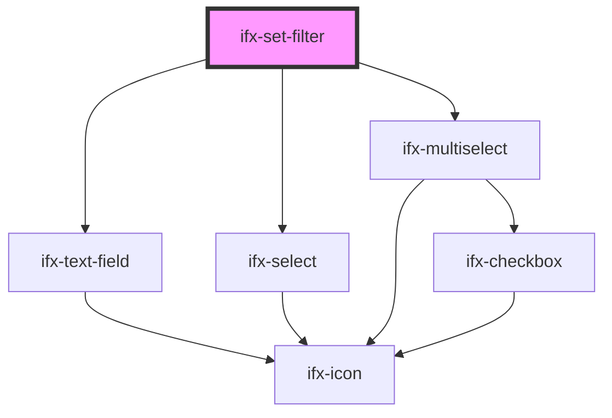

# set-filter

<!-- Auto Generated Below -->

## Properties

| Property      | Attribute      | Description | Type                                          | Default     |
| ------------- | -------------- | ----------- | --------------------------------------------- | ----------- |
| `filterLabel` | `filter-label` |             | `string`                                      | `undefined` |
| `filterName`  | `filter-name`  |             | `string`                                      | `undefined` |
| `options`     | `options`      |             | `any[] \| string`                             | `undefined` |
| `placeholder` | `placeholder`  |             | `string`                                      | `undefined` |
| `type`        | `type`         |             | `"multi-select" \| "single-select" \| "text"` | `'text'`    |

## Events

| Event             | Description | Type               |
| ----------------- | ----------- | ------------------ |
| `ifxFilterChange` |             | `CustomEvent<any>` |

## Dependencies

### Depends on

- [ifx-text-field](../text-field)
- [ifx-select](../select/single-select)
- [ifx-multiselect](../select/multi-select)

### Graph

----------------------------------------------

*Built with [StencilJS](https://stenciljs.com/)*
