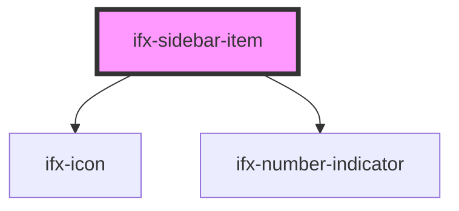

# ifx-sidebar-item

<!-- Auto Generated Below -->

## Properties

| Property          | Attribute          | Description | Type     | Default     |
| ----------------- | ------------------ | ----------- | -------- | ----------- |
| `href`            | `href`             |             | `string` | `""`        |
| `icon`            | `icon`             |             | `string` | `""`        |
| `numberIndicator` | `number-indicator` |             | `number` | `undefined` |
| `target`          | `target`           |             | `string` | `"_self"`   |

## Dependencies

### Depends on

- [ifx-icon](../icon)
- [ifx-number-indicator](../number-indicator)

### Graph

----------------------------------------------

*Built with [StencilJS](https://stenciljs.com/)*
