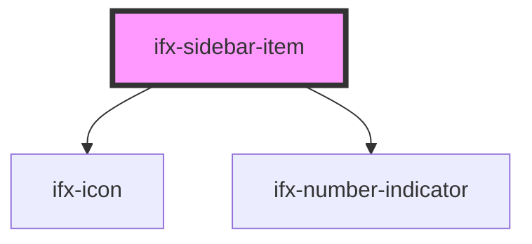

# ifx-sidebar-item

<!-- Auto Generated Below -->

## Properties

| Property          | Attribute          | Description | Type                          | Default     |
| ----------------- | ------------------ | ----------- | ----------------------------- | ----------- |
| `active`          | `active`           |             | `boolean`                     | `false`     |
| `handleItemClick` | --                 |             | `(item: HTMLElement) => void` | `undefined` |
| `href`            | `href`             |             | `string`                      | `""`        |
| `icon`            | `icon`             |             | `string`                      | `""`        |
| `isActionItem`    | `is-action-item`   |             | `boolean`                     | `false`     |
| `numberIndicator` | `number-indicator` |             | `number`                      | `undefined` |
| `target`          | `target`           |             | `string`                      | `"_self"`   |
| `value`           | `value`            |             | `string`                      | `""`        |

## Events

| Event                      | Description | Type               |
| -------------------------- | ----------- | ------------------ |
| `ifxSidebarActionItem`     |             | `CustomEvent<any>` |
| `ifxSidebarItem`           |             | `CustomEvent<any>` |
| `ifxSidebarNavigationItem` |             | `CustomEvent<any>` |

## Methods

### `setActiveClasses() => Promise<void>`

#### Returns

Type: `Promise<void>`

## Dependencies

### Depends on

- [ifx-icon](../icon)
- [ifx-number-indicator](../number-indicator)

### Graph

----------------------------------------------

*Built with [StencilJS](https://stenciljs.com/)*
