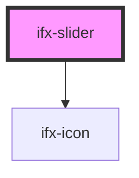

# ifx-tag

<!-- Auto Generated Below -->

## Properties

| Property         | Attribute          | Description | Type                   | Default     |
| ---------------- | ------------------ | ----------- | ---------------------- | ----------- |
| `disabled`       | `disabled`         |             | `boolean`              | `false`     |
| `leftIcon`       | `left-icon`        |             | `string`               | `undefined` |
| `leftText`       | `left-text`        |             | `string`               | `undefined` |
| `max`            | `max`              |             | `number`               | `100`       |
| `maxValueHandle` | `max-value-handle` |             | `number`               | `undefined` |
| `min`            | `min`              |             | `number`               | `0`         |
| `minValueHandle` | `min-value-handle` |             | `number`               | `undefined` |
| `rightIcon`      | `right-icon`       |             | `string`               | `undefined` |
| `rightText`      | `right-text`       |             | `string`               | `undefined` |
| `showPercentage` | `show-percentage`  |             | `boolean`              | `false`     |
| `type`           | `type`             |             | `"double" \| "single"` | `'single'`  |
| `value`          | `value`            |             | `number`               | `undefined` |

## Events

| Event       | Description | Type               |
| ----------- | ----------- | ------------------ |
| `ifxChange` |             | `CustomEvent<any>` |

## Dependencies

### Depends on

- [ifx-icon](../icon)

### Graph

----------------------------------------------

*Built with [StencilJS](https://stenciljs.com/)*
