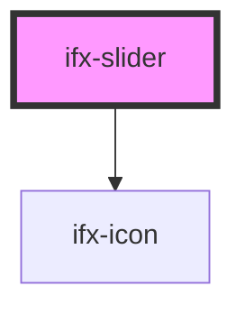

# ifx-tag

<!-- Auto Generated Below -->

## Properties

| Property         | Attribute          | Description                                                | Type                   | Default     |
| ---------------- | ------------------ | ---------------------------------------------------------- | ---------------------- | ----------- |
| `ariaLabelText`  | `aria-label-text`  | Accessible label for screen readers.                       | `string`               | `undefined` |
| `disabled`       | `disabled`         | If true, the slider is disabled and not interactive.       | `boolean`              | `false`     |
| `leftIcon`       | `left-icon`        | Optional icon displayed on the left side of the slider.    | `string`               | `undefined` |
| `leftText`       | `left-text`        | Optional text label shown on the left side of the slider.  | `string`               | `undefined` |
| `max`            | `max`              | Maximum value allowed for the slider.                      | `number`               | `100`       |
| `maxValueHandle` | `max-value-handle` | Initial value of the right handle for a double slider.     | `number`               | `undefined` |
| `min`            | `min`              | Minimum value allowed for the slider.                      | `number`               | `0`         |
| `minValueHandle` | `min-value-handle` | Initial value of the left handle for a double slider.      | `number`               | `undefined` |
| `rightIcon`      | `right-icon`       | Optional icon displayed on the right side of the slider.   | `string`               | `undefined` |
| `rightText`      | `right-text`       | Optional text label shown on the right side of the slider. | `string`               | `undefined` |
| `showPercentage` | `show-percentage`  | If true, shows the current value as a percentage.          | `boolean`              | `false`     |
| `step`           | `step`             | Increment step when changing the value.                    | `number`               | `1`         |
| `type`           | `type`             | Slider type: single handle or double handle (range).       | `"double" \| "single"` | `"single"`  |
| `value`          | `value`            | Current value for a single-handle slider.                  | `number`               | `undefined` |

## Events

| Event       | Description                                     | Type               |
| ----------- | ----------------------------------------------- | ------------------ |
| `ifxChange` | Fired when the slider value (or values) change. | `CustomEvent<any>` |

## Dependencies

### Depends on

- [ifx-icon](../icon)

### Graph

```mermaid
graph TD;
  ifx-slider --> ifx-icon
  style ifx-slider fill:#f9f,stroke:#333,stroke-width:4px
```

----------------------------------------------

*Built with [StencilJS](https://stenciljs.com/)*
