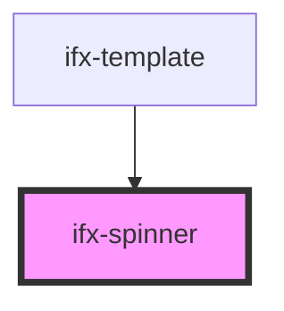

# ifx-spinner

<!-- Auto Generated Below -->

## Properties

| Property        | Attribute         | Description                                                 | Type                   | Default     |
| --------------- | ----------------- | ----------------------------------------------------------- | ---------------------- | ----------- |
| `ariaLabelText` | `aria-label-text` | Accessible label announced by assistive technologies.       | `string`               | `undefined` |
| `inverted`      | `inverted`        | Renders the spinner in inverted color for dark backgrounds. | `boolean`              | `false`     |
| `size`          | `size`            | Visual size of the spinner.                                 | `"m" \| "s"`           | `"m"`       |
| `variant`       | `variant`         | Spinner style variant.                                      | `"brand" \| "default"` | `"default"` |

## Dependencies

### Used by

 - [ifx-template](../templates/template)

### Graph

```mermaid
graph TD;
  ifx-template --> ifx-spinner
  style ifx-spinner fill:#f9f,stroke:#333,stroke-width:4px
```

----------------------------------------------

*Built with [StencilJS](https://stenciljs.com/)*
