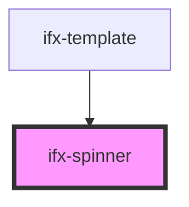

# ifx-spinner

<!-- Auto Generated Below -->

## Properties

| Property        | Attribute         | Description                                               | Type      | Default     |
| --------------- | ----------------- | --------------------------------------------------------- | --------- | ----------- |
| `ariaLabelText` | `aria-label-text` | Accessible label for screen readers.                      | `string`  | `undefined` |
| `inverted`      | `inverted`        | If true, uses the inverted color scheme.                  | `boolean` | `false`     |
| `size`          | `size`            | Size of the indicator (e.g. small, medium, large).        | `string`  | `undefined` |
| `variant`       | `variant`         | Visual style variant of the indicator (e.g. number, dot). | `string`  | `undefined` |

## Dependencies

### Used by

 - [ifx-template](../templates/template)

### Graph

```mermaid
graph TD;
  ifx-template --> ifx-spinner
  style ifx-spinner fill:#f9f,stroke:#333,stroke-width:4px
```

----------------------------------------------

*Built with [StencilJS](https://stenciljs.com/)*
