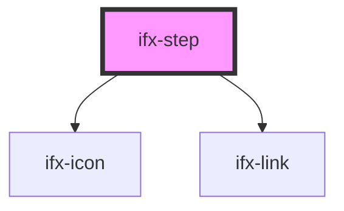

# dev-step

<!-- Auto Generated Below -->

## Properties

| Property       | Attribute   | Description                                                                     | Type           | Default                                                                                                                                                                                                                                                                             |
| -------------- | ----------- | ------------------------------------------------------------------------------- | -------------- | ----------------------------------------------------------------------------------------------------------------------------------------------------------------------------------------------------------------------------------------------------------------------------------- |
| `complete`     | `complete`  | Sets the complete status of the step.                                           | `boolean`      | `false`                                                                                                                                                                                                                                                                             |
| `error`        | `error`     | Sets the error status of the step.                                              | `boolean`      | `false`                                                                                                                                                                                                                                                                             |
| `lastStep`     | `last-step` | An internal prop to identify the last step of the stepper.                      | `boolean`      | `false`                                                                                                                                                                                                                                                                             |
| `stepId`       | `step-id`   | An unique step id assigned to every step in the stepper.                        | `number`       | `1`                                                                                                                                                                                                                                                                                 |
| `stepperState` | --          | An internal prop to store the current state of the parent (stepper) components. | `StepperState` | `{ activeStep: 1,                                                               showStepNumber: false,                                                               variant: 'default',                                                               indicatorPosition: 'left' }` |

## Dependencies

### Depends on

- [ifx-icon](../../icon)
- [ifx-link](../../link)

### Graph

----------------------------------------------

*Built with [StencilJS](https://stenciljs.com/)*
