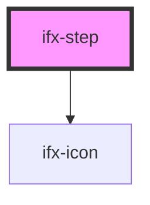

# dev-step

<!-- Auto Generated Below -->

## Properties

| Property       | Attribute       | Description | Type      | Default                                                  |
| -------------- | --------------- | ----------- | --------- | -------------------------------------------------------- |
| `error`        | `error`         |             | `boolean` | `false`                                                  |
| `lastStep`     | `last-step`     |             | `boolean` | `false`                                                  |
| `stepId`       | `step-id`       |             | `number`  | `1`                                                      |
| `stepperState` | `stepper-state` |             | `any`     | `{activeStep: 1, showNumber: false, variant: 'default'}` |

## Dependencies

### Depends on

- [ifx-icon](../../icon)

### Graph

----------------------------------------------

*Built with [StencilJS](https://stenciljs.com/)*
