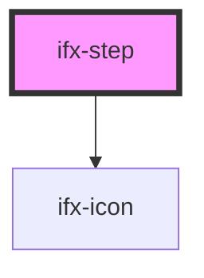

# ifx-step

<!-- Auto Generated Below -->

## Properties

| Property | Attribute | Description | Type      | Default        |
| -------- | --------- | ----------- | --------- | -------------- |
| `active` | `active`  |             | `boolean` | `false`        |
| `label`  | `label`   |             | `string`  | `undefined`    |
| `status` | `status`  |             | `string`  | `'incomplete'` |

## Dependencies

### Depends on

- [ifx-icon](../../icon)

### Graph

----------------------------------------------

*Built with [StencilJS](https://stenciljs.com/)*
