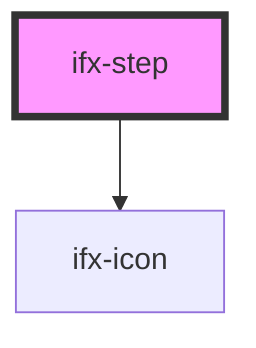

# dev-step

<!-- Auto Generated Below -->

## Properties

| Property       | Attribute   | Description                                                             | Type           | Default                                                                                                    |
| -------------- | ----------- | ----------------------------------------------------------------------- | -------------- | ---------------------------------------------------------------------------------------------------------- |
| `complete`     | `complete`  | If true, marks this step as completed.                                  | `boolean`      | `false`                                                                                                    |
| `disabled`     | `disabled`  | If true, this step is disabled and not clickable.                       | `boolean`      | `false`                                                                                                    |
| `error`        | `error`     | If true, this step is in an error state.                                | `boolean`      | `false`                                                                                                    |
| `lastStep`     | `last-step` | Whether this is the last step in the stepper.                           | `boolean`      | `false`                                                                                                    |
| `stepId`       | `step-id`   | Numeric identifier / position of this step.                             | `number`       | `1`                                                                                                        |
| `stepperState` | --          | Shared configuration for the whole stepper (active step, layout, etc.). | `StepperState` | `{     activeStep: 1,     showStepNumber: false,     variant: "default",     indicatorPosition: "left", }` |

## Dependencies

### Depends on

- [ifx-icon](../../icon)

### Graph

```mermaid
graph TD;
  ifx-step --> ifx-icon
  style ifx-step fill:#f9f,stroke:#333,stroke-width:4px
```

----------------------------------------------

*Built with [StencilJS](https://stenciljs.com/)*
