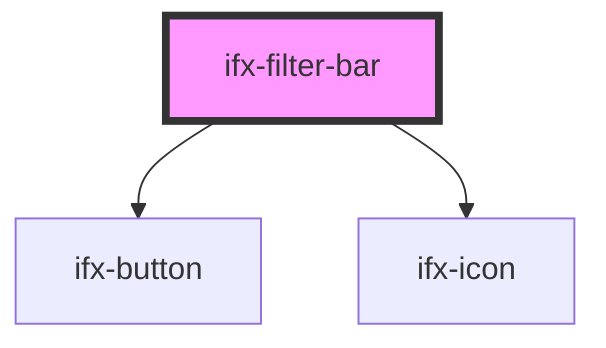

# ifx-filter-bar

<!-- Auto Generated Below -->

## Properties

| Property                | Attribute                  | Description | Type      | Default |
| ----------------------- | -------------------------- | ----------- | --------- | ------- |
| `maxShownFilters`       | `max-shown-filters`        |             | `number`  | `4`     |
| `showMoreFiltersButton` | `show-more-filters-button` |             | `boolean` | `true`  |

## Events

| Event                   | Description | Type               |
| ----------------------- | ----------- | ------------------ |
| `ifxTopbarFilterChange` |             | `CustomEvent<any>` |

## Dependencies

### Depends on

- [ifx-button](../../button)
- [ifx-icon](../../icon)

### Graph

----------------------------------------------

*Built with [StencilJS](https://stenciljs.com/)*
