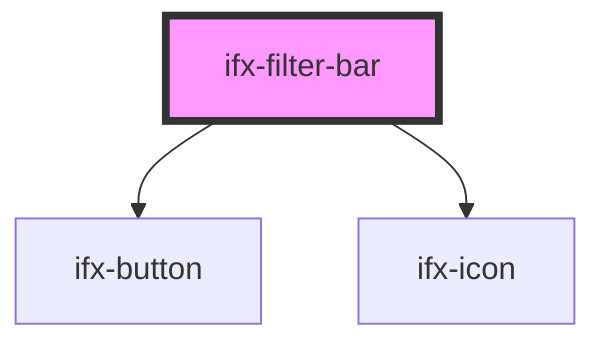

# ifx-filter-bar

<!-- Auto Generated Below -->

## Properties

| Property          | Attribute           | Description                                                       | Type     | Default |
| ----------------- | ------------------- | ----------------------------------------------------------------- | -------- | ------- |
| `maxShownFilters` | `max-shown-filters` | Maximum number of filters to show in the topbar before collapsing | `number` | `4`     |

## Events

| Event                   | Description                          | Type               |
| ----------------------- | ------------------------------------ | ------------------ |
| `ifxTopbarFilterChange` | Emitted when a topbar filter changes | `CustomEvent<any>` |

## Methods

### `showMoreFilters(showMore: boolean) => Promise<void>`

Controls "More / Less filters" Buttons

#### Parameters

| Name       | Type      | Description |
| ---------- | --------- | ----------- |
| `showMore` | `boolean` |             |

#### Returns

Type: `Promise<void>`

## Dependencies

### Depends on

- [ifx-button](../../button)
- [ifx-icon](../../icon)

### Graph

```mermaid
graph TD;
  ifx-filter-bar --> ifx-button
  ifx-filter-bar --> ifx-icon
  style ifx-filter-bar fill:#f9f,stroke:#333,stroke-width:4px
```

----------------------------------------------

*Built with [StencilJS](https://stenciljs.com/)*
