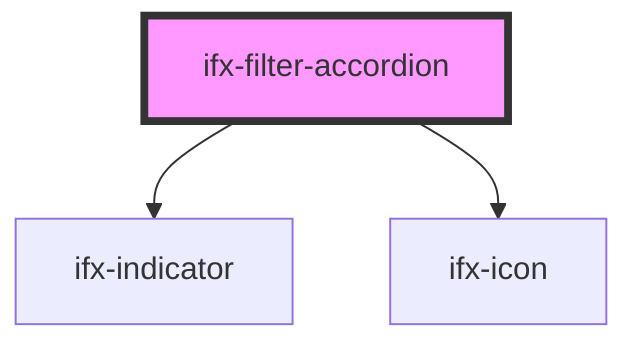

# ifx-filter-accordion

<!-- Auto Generated Below -->

## Properties

| Property          | Attribute           | Description | Type     | Default     |
| ----------------- | ------------------- | ----------- | -------- | ----------- |
| `filterGroupName` | `filter-group-name` |             | `string` | `""`        |
| `maxVisibleItems` | `max-visible-items` |             | `number` | `undefined` |

## Events

| Event                      | Description | Type               |
| -------------------------- | ----------- | ------------------ |
| `ifxFilterAccordionChange` |             | `CustomEvent<any>` |

## Dependencies

### Depends on

- [ifx-indicator](../../../indicator)
- [ifx-icon](../../../icon)

### Graph

----------------------------------------------

*Built with [StencilJS](https://stenciljs.com/)*
