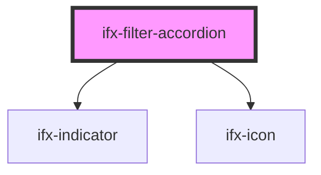

# ifx-filter-accordion

<!-- Auto Generated Below -->

## Properties

| Property          | Attribute           | Description                                                          | Type     | Default     |
| ----------------- | ------------------- | -------------------------------------------------------------------- | -------- | ----------- |
| `filterGroupName` | `filter-group-name` | Identifier/label for the filter group                                | `""`     | `""`        |
| `maxVisibleItems` | `max-visible-items` | Max number of items to display before truncating/collapsing the list | `number` | `undefined` |

## Events

| Event                      | Description                                                    | Type               |
| -------------------------- | -------------------------------------------------------------- | ------------------ |
| `ifxFilterAccordionChange` | Emitted when the filter accordion`s state or selection changes | `CustomEvent<any>` |

## Dependencies

### Depends on

- [ifx-indicator](../../../indicator)
- [ifx-icon](../../../icon)

### Graph

```mermaid
graph TD;
  ifx-filter-accordion --> ifx-indicator
  ifx-filter-accordion --> ifx-icon
  style ifx-filter-accordion fill:#f9f,stroke:#333,stroke-width:4px
```

----------------------------------------------

*Built with [StencilJS](https://stenciljs.com/)*
