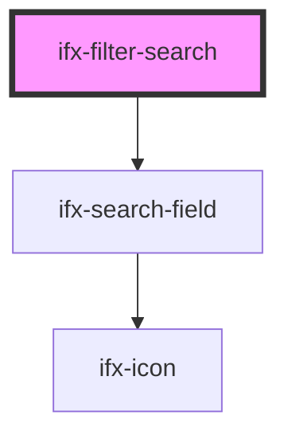

# ifx-filter-search

<!-- Auto Generated Below -->

## Properties

| Property            | Attribute            | Description                                       | Type      | Default     |
| ------------------- | -------------------- | ------------------------------------------------- | --------- | ----------- |
| `disabled`          | `disabled`           | Disables the filter and prevents user interaction | `boolean` | `false`     |
| `filterKey`         | `filter-key`         | Unique key/identifier for this filter             | `string`  | `undefined` |
| `filterName`        | `filter-name`        | Display name/label for this filter input          | `string`  | `undefined` |
| `filterOrientation` | `filter-orientation` | Layout context for the filter                     | `string`  | `"sidebar"` |
| `filterValue`       | `filter-value`       | Current filter text/value                         | `string`  | `undefined` |
| `placeholder`       | `placeholder`        | Placeholder text shown when input is empty        | `string`  | `undefined` |

## Events

| Event                   | Description                                  | Type               |
| ----------------------- | -------------------------------------------- | ------------------ |
| `ifxFilterSearchChange` | Emitted when the filter/search value changes | `CustomEvent<any>` |

## Dependencies

### Depends on

- [ifx-search-field](../../../search-field)

### Graph

----------------------------------------------

*Built with [StencilJS](https://stenciljs.com/)*
