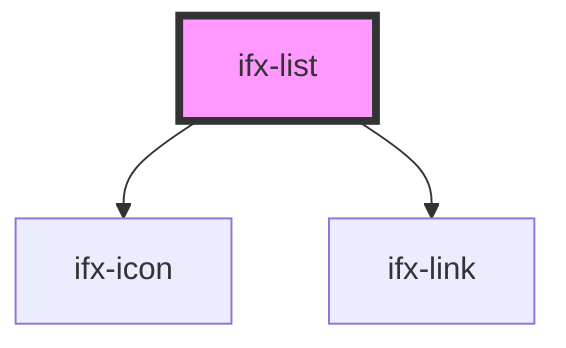

# ifx-list

<!-- Auto Generated Below -->

## Properties

| Property          | Attribute           | Description                                                | Type      | Default      |
| ----------------- | ------------------- | ---------------------------------------------------------- | --------- | ------------ |
| `maxVisibleItems` | `max-visible-items` | Max number of items displayed before collapsing/truncating | `6`       | `6`          |
| `name`            | `name`              | Unique name/identifier for the list                        | `""`      | `""`         |
| `resetTrigger`    | `reset-trigger`     | External, mutable flag to trigger a programmic reset       | `boolean` | `undefined`  |
| `type`            | `type`              | Selection type for list entries                            | `string`  | `"checkbox"` |

## Events

| Event           | Description                                             | Type               |
| --------------- | ------------------------------------------------------- | ------------------ |
| `ifxListUpdate` | Emitted when the list's items or selections are updated | `CustomEvent<any>` |

## Dependencies

### Depends on

- [ifx-icon](../../icon)
- [ifx-link](../../link)

### Graph

----------------------------------------------

*Built with [StencilJS](https://stenciljs.com/)*
