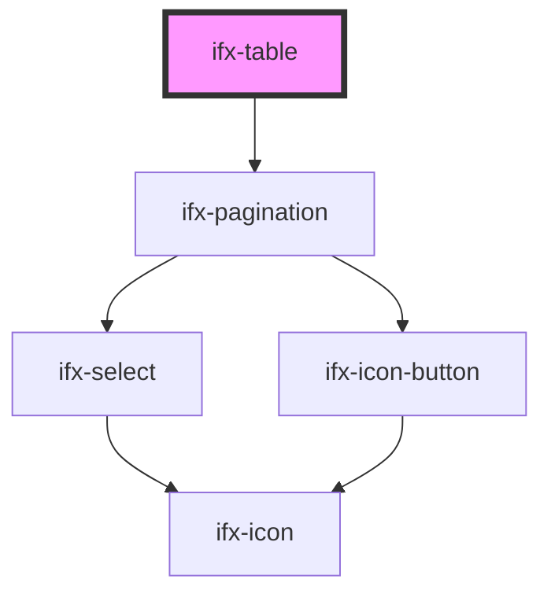

# ifx-table

<!-- Auto Generated Below -->

## Properties

| Property             | Attribute              | Description | Type              | Default     |
| -------------------- | ---------------------- | ----------- | ----------------- | ----------- |
| `cols`               | `cols`                 |             | `any[] \| string` | `undefined` |
| `pagination`         | `pagination`           |             | `boolean`         | `true`      |
| `paginationPageSize` | `pagination-page-size` |             | `number`          | `10`        |
| `rowHeight`          | `row-height`           |             | `string`          | `'default'` |
| `rows`               | `rows`                 |             | `any[] \| string` | `undefined` |
| `showLoading`        | `show-loading`         |             | `boolean`         | `false`     |
| `tableHeight`        | `table-height`         |             | `string`          | `'auto'`    |

## Methods

### `onBtShowLoading() => Promise<void>`

#### Returns

Type: `Promise<void>`

## Dependencies

### Depends on

- [ifx-pagination](../pagination)

### Graph

----------------------------------------------

*Built with [StencilJS](https://stenciljs.com/)*
