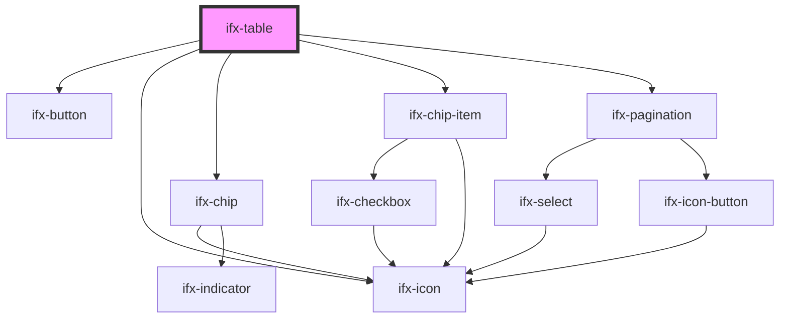

# ifx-table

<!-- Auto Generated Below -->

## Properties

| Property                    | Attribute                   | Description | Type                                                                                        | Default     |
| --------------------------- | --------------------------- | ----------- | ------------------------------------------------------------------------------------------- | ----------- |
| `buttonRendererOptions`     | --                          |             | `{ onButtonClick?: (params: any, event: Event) => void; }`                                  | `undefined` |
| `checkboxRendererOptions`   | --                          |             | `{ onCheckboxClick?: (params: any, event: Event) => void; }`                                | `undefined` |
| `cols`                      | `cols`                      |             | `any`                                                                                       | `undefined` |
| `columnMinWidth`            | `column-min-width`          |             | `number`                                                                                    | `undefined` |
| `columnWidth`               | `column-width`              |             | `string`                                                                                    | `undefined` |
| `enableSelection`           | `enable-selection`          |             | `boolean`                                                                                   | `false`     |
| `filterOrientation`         | `filter-orientation`        |             | `string`                                                                                    | `"sidebar"` |
| `fitColumns`                | `fit-columns`               |             | `boolean`                                                                                   | `false`     |
| `headline`                  | `headline`                  |             | `string`                                                                                    | `""`        |
| `iconButtonRendererOptions` | --                          |             | `{ onIconButtonClick?: (params: any, event: Event) => void; }`                              | `undefined` |
| `pagination`                | `pagination`                |             | `boolean`                                                                                   | `true`      |
| `paginationItemsPerPage`    | `pagination-items-per-page` |             | `string`                                                                                    | `undefined` |
| `rowHeight`                 | `row-height`                |             | `string`                                                                                    | `"default"` |
| `rows`                      | `rows`                      |             | `any`                                                                                       | `undefined` |
| `serverPageChangeHandler`   | --                          |             | `(params: { page: number; pageSize: number; }) => Promise<{ rows: any[]; total: number; }>` | `undefined` |
| `serverSidePagination`      | `server-side-pagination`    |             | `boolean`                                                                                   | `false`     |
| `showLoading`               | `show-loading`              |             | `boolean`                                                                                   | `false`     |
| `tableHeight`               | `table-height`              |             | `string`                                                                                    | `"auto"`    |
| `variant`                   | `variant`                   |             | `string`                                                                                    | `"default"` |

## Events

| Event           | Description | Type               |
| --------------- | ----------- | ------------------ |
| `ifxSortChange` |             | `CustomEvent<any>` |

## Methods

### `onBtShowLoading() => Promise<void>`

#### Returns

Type: `Promise<void>`

## Dependencies

### Depends on

- [ifx-button](../button)
- [ifx-icon](../icon)
- [ifx-chip](../chip)
- [ifx-chip-item](../chip/chip-item)
- [ifx-pagination](../pagination)

### Graph

----------------------------------------------

*Built with [StencilJS](https://stenciljs.com/)*
