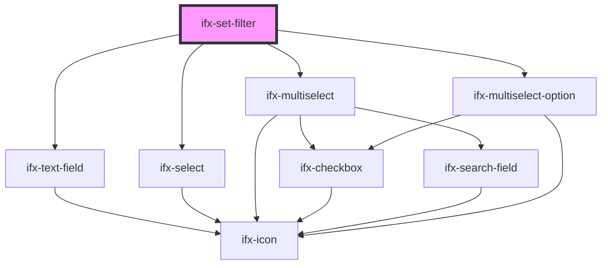

# set-filter

<!-- Auto Generated Below -->

## Properties

| Property      | Attribute      | Description                                              | Type                                          | Default     |
| ------------- | -------------- | -------------------------------------------------------- | --------------------------------------------- | ----------- |
| `filterLabel` | `filter-label` | User-visible label for the filter control                | `string`                                      | `undefined` |
| `filterName`  | `filter-name`  | Technical name/identifier for this filter                | `string`                                      | `undefined` |
| `options`     | `options`      | Options for select types, either array or string         | `any[] \| string`                             | `undefined` |
| `placeholder` | `placeholder`  | Placeholder text shown when no value is entered/selected | `string`                                      | `undefined` |
| `type`        | `type`         | Filter control type                                      | `"multi-select" \| "single-select" \| "text"` | `"text"`    |

## Events

| Event             | Description                                          | Type               |
| ----------------- | ---------------------------------------------------- | ------------------ |
| `ifxFilterSelect` | Emitted when the filter's value or selection changes | `CustomEvent<any>` |

## Dependencies

### Depends on

- [ifx-text-field](../../text-field)
- [ifx-select](../../select/single-select)
- [ifx-multiselect](../../select/multi-select)
- [ifx-multiselect-option](../../select/multi-select)

### Graph

----------------------------------------------

*Built with [StencilJS](https://stenciljs.com/)*
