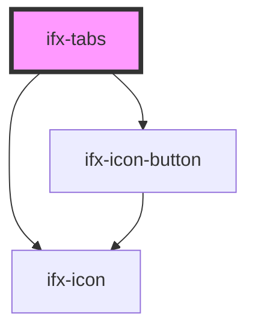

# ifx-tabs

<!-- Auto Generated Below -->

## Properties

| Property         | Attribute          | Description | Type      | Default        |
| ---------------- | ------------------ | ----------- | --------- | -------------- |
| `activeTabIndex` | `active-tab-index` |             | `number`  | `0`            |
| `fullWidth`      | `full-width`       |             | `boolean` | `false`        |
| `orientation`    | `orientation`      |             | `string`  | `"horizontal"` |

## Events

| Event       | Description | Type               |
| ----------- | ----------- | ------------------ |
| `ifxChange` |             | `CustomEvent<any>` |

## Dependencies

### Depends on

- [ifx-icon-button](../icon-button)
- [ifx-icon](../icon)

### Graph

----------------------------------------------

*Built with [StencilJS](https://stenciljs.com/)*
