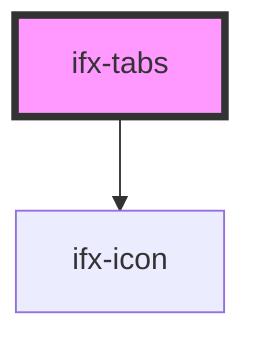

# ifx-tabs

<!-- Auto Generated Below -->

## Properties

| Property         | Attribute          | Description | Type                                        | Default        |
| ---------------- | ------------------ | ----------- | ------------------------------------------- | -------------- |
| `activeTabIndex` | `active-tab-index` |             | `number`                                    | `0`            |
| `orientation`    | `orientation`      |             | `string`                                    | `"horizontal"` |
| `tabs`           | --                 |             | `{ header: string; disabled?: boolean; }[]` | `[]`           |

## Events

| Event          | Description | Type               |
| -------------- | ----------- | ------------------ |
| `ifxTabChange` |             | `CustomEvent<any>` |

## Dependencies

### Depends on

- [ifx-icon](../icon)

### Graph

----------------------------------------------

*Built with [StencilJS](https://stenciljs.com/)*
