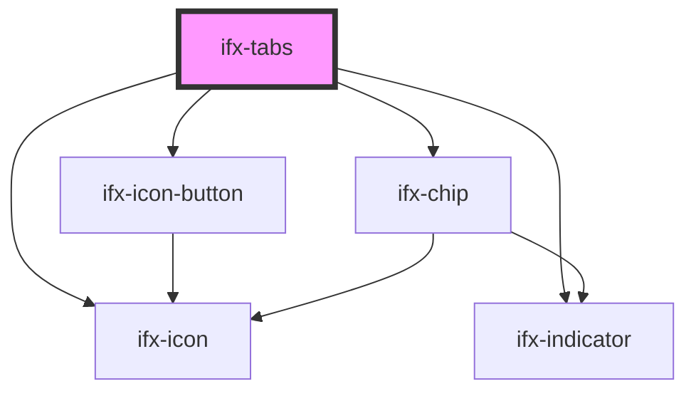

# ifx-tabs

<!-- Auto Generated Below -->

## Properties

| Property         | Attribute          | Description                                                      | Type                      | Default                        |
| ---------------- | ------------------ | ---------------------------------------------------------------- | ------------------------- | ------------------------------ |
| `activeTabIndex` | `active-tab-index` | Index of the currently active tab.                               | `number`                  | `0`                            |
| `fullWidth`      | `full-width`       | Stretches tabs to evenly fill the available horizontal space.    | `boolean`                 | `false`                        |
| `label`          | `label`            | Text of the Advanced-Tab-Label                                   | `string`                  | `undefined`                    |
| `number`         | `number`           | Number of the Advanced-Tab-Number                                | `number`                  | `0`                            |
| `orientation`    | `orientation`      | Orientation of tab list, either horizontal or vertical.          | `string`                  | `"horizontal"`                 |
| `sticky`         | `sticky`           | Makes the tab header stick to the top of its scrolling oontainer | `boolean`                 | `false`                        |
| `subline`        | `subline`          | Subline under the header, only for advanced variant.             | `string`                  | `'This could be a small text'` |
| `variant`        | `variant`          | Sets variant of tab, either default or advanced.                 | `"advanced" \| "default"` | `'default'`                    |

## Events

| Event       | Description                                                               | Type               |
| ----------- | ------------------------------------------------------------------------- | ------------------ |
| `ifxChange` | Emitted when the active tab changes (e.g., user selects a different tab). | `CustomEvent<any>` |

## Dependencies

### Depends on

- [ifx-icon-button](../icon-button)
- [ifx-icon](../icon)
- [ifx-indicator](../indicator)
- [ifx-chip](../chip)

### Graph

----------------------------------------------

*Built with [StencilJS](https://stenciljs.com/)*
