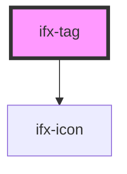

# ifx-tag

<!-- Auto Generated Below -->

## Properties

| Property    | Attribute    | Description | Type     | Default     |
| ----------- | ------------ | ----------- | -------- | ----------- |
| `ariaLabel` | `aria-label` |             | `string` | `undefined` |
| `icon`      | `icon`       |             | `string` | `undefined` |

## Dependencies

### Depends on

- [ifx-icon](../icon)

### Graph

----------------------------------------------

*Built with [StencilJS](https://stenciljs.com/)*
