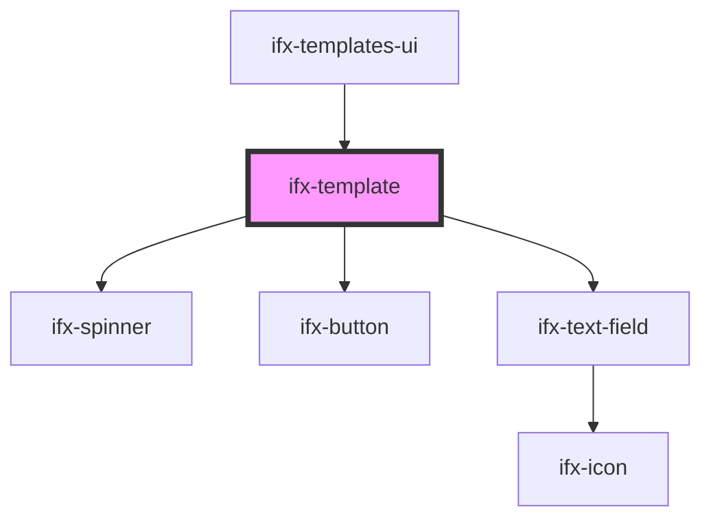

# ifx-template

<!-- Auto Generated Below -->

## Properties

| Property | Attribute | Description | Type     | Default     |
| -------- | --------- | ----------- | -------- | ----------- |
| `name`   | `name`    |             | `string` | `undefined` |

## Events

| Event             | Description | Type               |
| ----------------- | ----------- | ------------------ |
| `toggleTemplates` |             | `CustomEvent<any>` |

## Methods

### `toggleTemplate(currTemp: any) => Promise<void>`

#### Parameters

| Name       | Type  | Description |
| ---------- | ----- | ----------- |
| `currTemp` | `any` |             |

#### Returns

Type: `Promise<void>`

## Dependencies

### Used by

 - [ifx-templates-ui](../templates-ui)

### Depends on

- [ifx-spinner](../../spinner)
- [ifx-button](../../button)
- [ifx-text-field](../../text-field)

### Graph

----------------------------------------------

*Built with [StencilJS](https://stenciljs.com/)*
