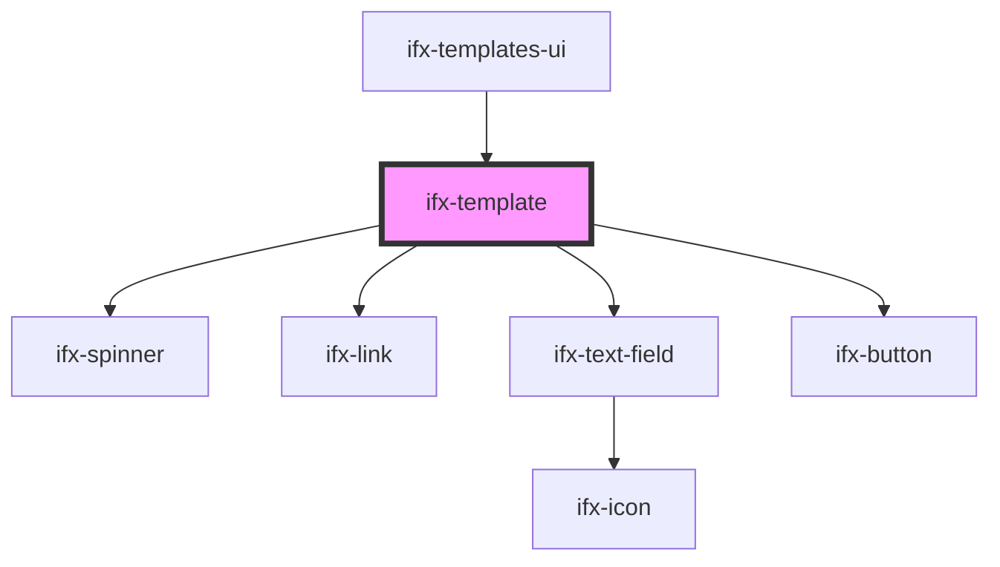

# ifx-template

<!-- Auto Generated Below -->

## Properties

| Property    | Attribute   | Description                                         | Type     | Default     |
| ----------- | ----------- | --------------------------------------------------- | -------- | ----------- |
| `name`      | `name`      | Name of the template field.                         | `string` | `undefined` |
| `thumbnail` | `thumbnail` | Thumbnail image URL or identifier for the template. | `string` | `undefined` |

## Events

| Event             | Description                                        | Type               |
| ----------------- | -------------------------------------------------- | ------------------ |
| `fieldError`      | Fired when a validation error occurs on the field. | `CustomEvent<any>` |
| `toggleTemplates` | Fired when templates are toggled on or off.        | `CustomEvent<any>` |

## Methods

### `toggleTemplate(currTemp: any) => Promise<void>`

Toggles visibility of this template and hides the currently open one if needed.

#### Parameters

| Name       | Type  | Description |
| ---------- | ----- | ----------- |
| `currTemp` | `any` |             |

#### Returns

Type: `Promise<void>`

## Dependencies

### Used by

 - [ifx-templates-ui](../templates-ui)

### Depends on

- [ifx-spinner](../../spinner)
- [ifx-link](../../link)
- [ifx-text-field](../../text-field)
- [ifx-button](../../button)

### Graph

```mermaid
graph TD;
  ifx-template --> ifx-spinner
  ifx-template --> ifx-link
  ifx-template --> ifx-text-field
  ifx-template --> ifx-button
  ifx-text-field --> ifx-icon
  ifx-templates-ui --> ifx-template
  style ifx-template fill:#f9f,stroke:#333,stroke-width:4px
```

----------------------------------------------

*Built with [StencilJS](https://stenciljs.com/)*
