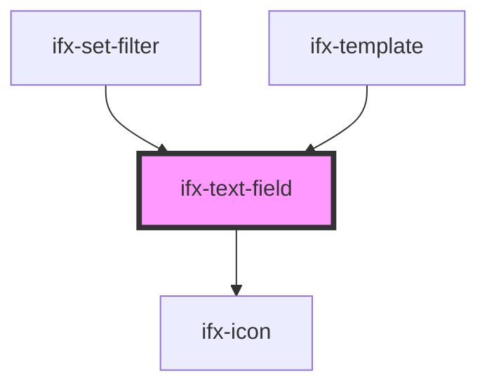

# ifx-text-field

<!-- Auto Generated Below -->

## Properties

| Property         | Attribute          | Description | Type                   | Default         |
| ---------------- | ------------------ | ----------- | ---------------------- | --------------- |
| `autocomplete`   | `autocomplete`     |             | `string`               | `"on"`          |
| `caption`        | `caption`          |             | `string`               | `""`            |
| `disabled`       | `disabled`         |             | `boolean`              | `false`         |
| `error`          | `error`            |             | `boolean`              | `false`         |
| `icon`           | `icon`             |             | `string`               | `""`            |
| `internalId`     | `internal-id`      |             | `string`               | `"text-field"`  |
| `label`          | `label`            |             | `string`               | `""`            |
| `maxlength`      | `maxlength`        |             | `number`               | `undefined`     |
| `placeholder`    | `placeholder`      |             | `string`               | `"Placeholder"` |
| `readOnly`       | `read-only`        |             | `boolean`              | `false`         |
| `required`       | `required`         |             | `boolean`              | `false`         |
| `showDeleteIcon` | `show-delete-icon` |             | `boolean`              | `false`         |
| `size`           | `size`             |             | `string`               | `"m"`           |
| `success`        | `success`          |             | `boolean`              | `false`         |
| `type`           | `type`             |             | `"password" \| "text"` | `"text"`        |
| `value`          | `value`            |             | `string`               | `""`            |

## Events

| Event      | Description | Type                  |
| ---------- | ----------- | --------------------- |
| `ifxInput` |             | `CustomEvent<string>` |

## Methods

### `reset() => Promise<void>`

#### Returns

Type: `Promise<void>`

## Dependencies

### Used by

 - [ifx-set-filter](../table-advanced-version/set-filter)
 - [ifx-template](../templates/template)

### Depends on

- [ifx-icon](../icon)

### Graph

----------------------------------------------

*Built with [StencilJS](https://stenciljs.com/)*
