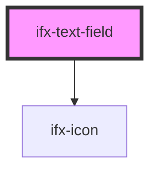

# ifx-text-field

<!-- Auto Generated Below -->

## Properties

| Property      | Attribute      | Description | Type      | Default         |
| ------------- | -------------- | ----------- | --------- | --------------- |
| `captionText` | `caption-text` |             | `string`  | `""`            |
| `disabled`    | `disabled`     |             | `boolean` | `false`         |
| `error`       | `error`        |             | `boolean` | `false`         |
| `icon`        | `icon`         |             | `boolean` | `false`         |
| `label`       | `label`        |             | `string`  | `"Placeholder"` |
| `placeholder` | `placeholder`  |             | `string`  | `"Placeholder"` |
| `readonly`    | `readonly`     |             | `boolean` | `false`         |
| `size`        | `size`         |             | `string`  | `'m'`           |
| `success`     | `success`      |             | `boolean` | `false`         |
| `value`       | `value`        |             | `string`  | `''`            |

## Events

| Event      | Description | Type                  |
| ---------- | ----------- | --------------------- |
| `ifxInput` |             | `CustomEvent<String>` |

## Dependencies

### Depends on

- [ifx-icon](../icon)

### Graph

----------------------------------------------

*Built with [StencilJS](https://stenciljs.com/)*
