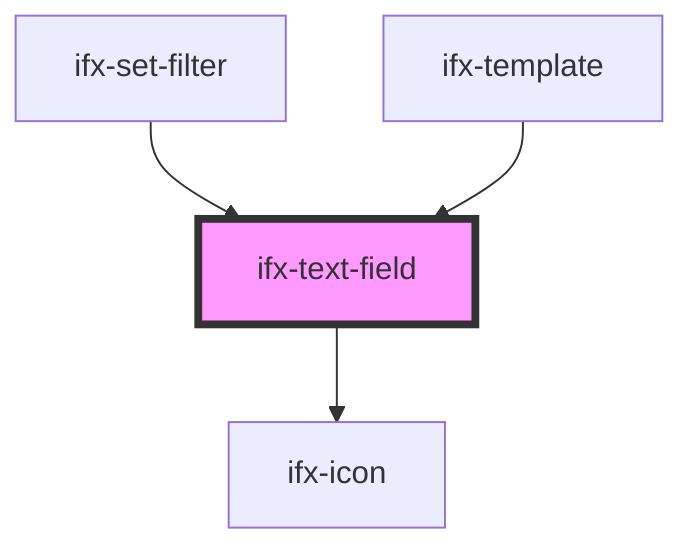

# ifx-text-field

<!-- Auto Generated Below -->

## Properties

| Property         | Attribute          | Description                                                        | Type                   | Default         |
| ---------------- | ------------------ | ------------------------------------------------------------------ | ---------------------- | --------------- |
| `autocomplete`   | `autocomplete`     | Native autocomplete attribute value.                               | `string`               | `"on"`          |
| `caption`        | `caption`          | Helper text shown below the text field.                            | `string`               | `""`            |
| `disabled`       | `disabled`         | If true, the text field is disabled and not interactive.           | `boolean`              | `false`         |
| `error`          | `error`            | If true, shows the text field in an error state.                   | `boolean`              | `false`         |
| `icon`           | `icon`             | Optional icon shown inside or next to the text field.              | `string`               | `""`            |
| `internalId`     | `internal-id`      | Internal ID used to link label and input elements.                 | `string`               | `"text-field"`  |
| `label`          | `label`            | Label text shown above the text field.                             | `string`               | `""`            |
| `maxlength`      | `maxlength`        | Maximum number of characters allowed.                              | `number`               | `undefined`     |
| `placeholder`    | `placeholder`      | Placeholder text shown when the field is empty.                    | `string`               | `"Placeholder"` |
| `readOnly`       | `read-only`        | If true, the text field is read-only but focusable.                | `boolean`              | `false`         |
| `required`       | `required`         | Whether a value is required (used for validation).                 | `boolean`              | `false`         |
| `showDeleteIcon` | `show-delete-icon` | If true, shows a delete/clear icon to remove the current value.    | `boolean`              | `false`         |
| `size`           | `size`             | Size of the text field (e.g. s, m, l).                             | `string`               | `"m"`           |
| `success`        | `success`          | If true, shows the text field in a success/valid state.            | `boolean`              | `false`         |
| `type`           | `type`             | Input type for the field (text or password).                       | `"password" \| "text"` | `"text"`        |
| `value`          | `value`            | Current value of the text field (can be updated programmatically). | `string`               | `""`            |

## Events

| Event      | Description                                     | Type                  |
| ---------- | ----------------------------------------------- | --------------------- |
| `ifxInput` | Fired when the user types or the value changes. | `CustomEvent<string>` |

## Methods

### `reset() => Promise<void>`

Resets the text field value and clears the underlying input element.

#### Returns

Type: `Promise<void>`

## Dependencies

### Used by

 - [ifx-set-filter](../table-advanced-version/set-filter)
 - [ifx-template](../templates/template)

### Depends on

- [ifx-icon](../icon)

### Graph

```mermaid
graph TD;
  ifx-text-field --> ifx-icon
  ifx-set-filter --> ifx-text-field
  ifx-template --> ifx-text-field
  style ifx-text-field fill:#f9f,stroke:#333,stroke-width:4px
```

----------------------------------------------

*Built with [StencilJS](https://stenciljs.com/)*
