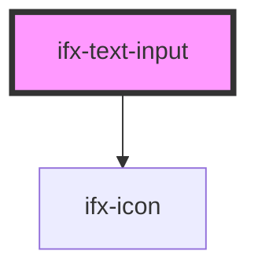

# ifx-text-input

<!-- Auto Generated Below -->

## Properties

| Property       | Attribute       | Description | Type      | Default         |
| -------------- | --------------- | ----------- | --------- | --------------- |
| `disabled`     | `disabled`      |             | `boolean` | `false`         |
| `error`        | `error`         |             | `boolean` | `false`         |
| `errorMessage` | `error-message` |             | `string`  | `""`            |
| `icon`         | `icon`          |             | `boolean` | `false`         |
| `placeholder`  | `placeholder`   |             | `string`  | `"Placeholder"` |
| `readonly`     | `readonly`      |             | `boolean` | `false`         |
| `success`      | `success`       |             | `boolean` | `false`         |
| `value`        | `value`         |             | `string`  | `''`            |

## Events

| Event      | Description | Type                  |
| ---------- | ----------- | --------------------- |
| `ifxInput` |             | `CustomEvent<String>` |

## Dependencies

### Depends on

- [ifx-icon](../icon)

### Graph

----------------------------------------------

*Built with [StencilJS](https://stenciljs.com/)*
