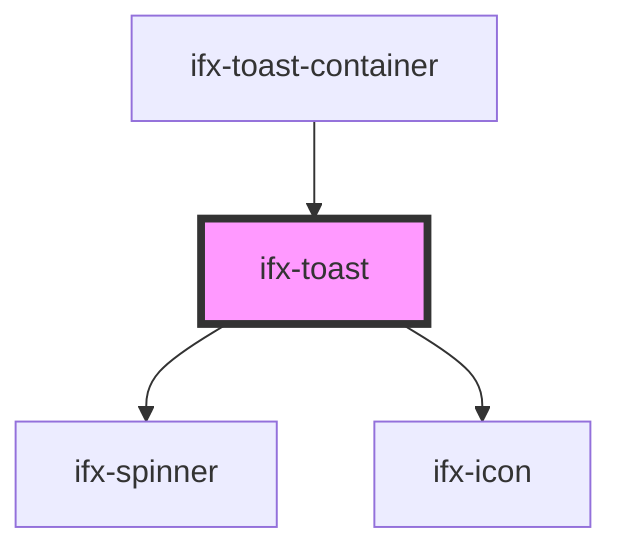

# ifx-toast

<!-- Auto Generated Below -->

## Properties

| Property     | Attribute     | Description                                                                                     | Type                                              | Default     |
| ------------ | ------------- | ----------------------------------------------------------------------------------------------- | ------------------------------------------------- | ----------- |
| `actionText` | `action-text` | Text for the trailing action button that dismisses the toast. Hidden when empty.                | `string`                                          | `undefined` |
| `duration`   | `duration`    | Auto-dismiss delay in ms. `0` disables auto-dismiss. The `loading` status never auto-dismisses. | `number`                                          | `5000`      |
| `message`    | `message`     | Message text. Falls back to the default slot when empty.                                        | `string`                                          | `undefined` |
| `status`     | `status`      | Status variant controlling the status icon and accent color.                                    | `"danger" \| "loading" \| "success" \| "warning"` | `"success"` |
| `toastId`    | `toast-id`    | Stable id emitted with every toast event. Auto-generated when not set.                          | `string`                                          | `undefined` |

## Events

| Event            | Description                                                        | Type                                 |
| ---------------- | ------------------------------------------------------------------ | ------------------------------------ |
| `ifxToastAction` | Emitted when the action is activated (before the toast dismisses). | `CustomEvent<ToastEventDetail>`      |
| `ifxToastClose`  | Emitted after the toast finished dismissing (animation complete).  | `CustomEvent<ToastCloseEventDetail>` |
| `ifxToastOpen`   | Emitted once the toast has been shown (mounted and rendered).      | `CustomEvent<ToastEventDetail>`      |

## Methods

### `dismiss(reason?: ToastCloseReason) => Promise<void>`

Programmatically dismisses the toast. Runs the exit animation and then emits `ifxToastClose`.

#### Parameters

| Name     | Type                                      | Description |
| -------- | ----------------------------------------- | ----------- |
| `reason` | `"timeout" \| "action" \| "programmatic"` |             |

#### Returns

Type: `Promise<void>`

## Dependencies

### Used by

 - [ifx-toast-container](toast-container)

### Depends on

- [ifx-spinner](../spinner)
- [ifx-icon](../icon)

### Graph

----------------------------------------------

*Built with [StencilJS](https://stenciljs.com/)*
