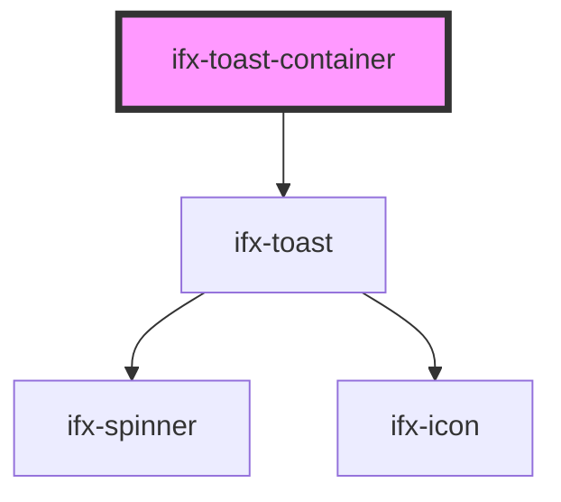

# ifx-toast-container

<!-- Auto Generated Below -->

## Properties

| Property         | Attribute         | Description                                                                                     | Type                                                                                              | Default          |
| ---------------- | ----------------- | ----------------------------------------------------------------------------------------------- | ------------------------------------------------------------------------------------------------- | ---------------- |
| `max`            | `max`             | Maximum number of simultaneously visible toasts. `0` means unlimited.                           | `number`                                                                                          | `0`              |
| `navbarSelector` | `navbar-selector` | CSS selector of the navbar/header to keep clear of on top placements. Empty disables measuring. | `string`                                                                                          | `"ifx-navbar"`   |
| `offset`         | `offset`          | Distance in px from the viewport edge. Added on top of the navbar clearance for top placements. | `number`                                                                                          | `16`             |
| `placement`      | `placement`       | Placement of the container on desktop. Collapses to top/bottom on mobile.                       | `"bottom-center" \| "bottom-left" \| "bottom-right" \| "top-center" \| "top-left" \| "top-right"` | `"bottom-right"` |

## Methods

### `addToast(config?: ToastConfig) => Promise<HTMLIfxToastElement>`

Creates an `ifx-toast`, appends it to the container, and removes it once dismissed.
Returns the created element so callers can update or dismiss it.

#### Parameters

| Name     | Type          | Description |
| -------- | ------------- | ----------- |
| `config` | `ToastConfig` |             |

#### Returns

Type: `Promise<HTMLIfxToastElement>`

### `dismissAll() => Promise<void>`

Dismisses every toast currently in the container.

#### Returns

Type: `Promise<void>`

### `enforceMax() => Promise<void>`

Dismisses the oldest toasts until at most `max` remain (`max <= 0` disables the
limit). Public so the `ifxToast` controller can enforce the cap after appending a
toast directly, not only via `addToast`.

#### Returns

Type: `Promise<void>`

## Slots

| Slot | Description      |
| ---- | ---------------- |
|      | The default slot |

## Dependencies

### Depends on

- [ifx-toast](..)

### Graph

----------------------------------------------

*Built with [StencilJS](https://stenciljs.com/)*
