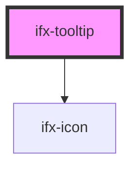

# ifx-tooltip

<!-- Auto Generated Below -->

## Properties

| Property       | Attribute        | Description | Type                                                                                                             | Default     |
| -------------- | ---------------- | ----------- | ---------------------------------------------------------------------------------------------------------------- | ----------- |
| `appendToBody` | `append-to-body` |             | `boolean`                                                                                                        | `false`     |
| `ariaLabel`    | `aria-label`     |             | `string`                                                                                                         | `undefined` |
| `header`       | `header`         |             | `string`                                                                                                         | `''`        |
| `icon`         | `icon`           |             | `string`                                                                                                         | `undefined` |
| `position`     | `position`       |             | `"auto" \| "bottom" \| "bottom-end" \| "bottom-start" \| "left" \| "right" \| "top" \| "top-end" \| "top-start"` | `'auto'`    |
| `text`         | `text`           |             | `string`                                                                                                         | `''`        |
| `variant`      | `variant`        |             | `"compact" \| "dismissible" \| "extended"`                                                                       | `'compact'` |

## Dependencies

### Depends on

- [ifx-icon](../icon)

### Graph

----------------------------------------------

*Built with [StencilJS](https://stenciljs.com/)*
