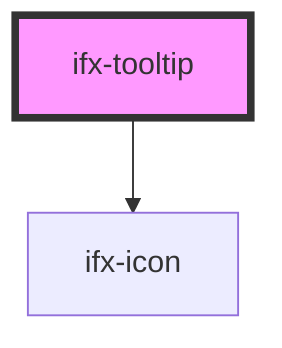

# ifx-tooltip

<!-- Auto Generated Below -->

## Properties

| Property        | Attribute         | Description                                                            | Type                                                                                                             | Default     |
| --------------- | ----------------- | ---------------------------------------------------------------------- | ---------------------------------------------------------------------------------------------------------------- | ----------- |
| `appendToBody`  | `append-to-body`  | If true, appends the tooltip element to document.body for positioning. | `boolean`                                                                                                        | `false`     |
| `ariaLabelText` | `aria-label-text` | Accessible label for screen readers.                                   | `string`                                                                                                         | `undefined` |
| `header`        | `header`          | Header text displayed at the top of the tooltip.                       | `string`                                                                                                         | `""`        |
| `icon`          | `icon`            | Optional icon displayed in the tooltip.                                | `string`                                                                                                         | `undefined` |
| `position`      | `position`        | Preferred position of the tooltip relative to the trigger element.     | `"auto" \| "bottom" \| "bottom-end" \| "bottom-start" \| "left" \| "right" \| "top" \| "top-end" \| "top-start"` | `"auto"`    |
| `text`          | `text`            | Main content text displayed inside the tooltip.                        | `string`                                                                                                         | `""`        |
| `variant`       | `variant`         | Visual style variant of the tooltip.                                   | `"compact" \| "dismissible" \| "extended"`                                                                       | `"compact"` |

## Dependencies

### Depends on

- [ifx-icon](../icon)

### Graph

```mermaid
graph TD;
  ifx-tooltip --> ifx-icon
  style ifx-tooltip fill:#f9f,stroke:#333,stroke-width:4px
```

----------------------------------------------

*Built with [StencilJS](https://stenciljs.com/)*
