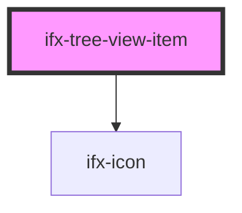

# ifx-tree-view-item

<!-- Auto Generated Below -->

## Properties

| Property            | Attribute            | Description | Type                 | Default     |
| ------------------- | -------------------- | ----------- | -------------------- | ----------- |
| `expanded`          | `expanded`           |             | `boolean`            | `false`     |
| `icon`              | `icon`               |             | `"file" \| "folder"` | `'file'`    |
| `initiallyExpanded` | `initially-expanded` |             | `boolean`            | `false`     |
| `label`             | `label`              |             | `string`             | `undefined` |

## Dependencies

### Depends on

- [ifx-icon](../icon)

### Graph

----------------------------------------------

*Built with [StencilJS](https://stenciljs.com/)*
