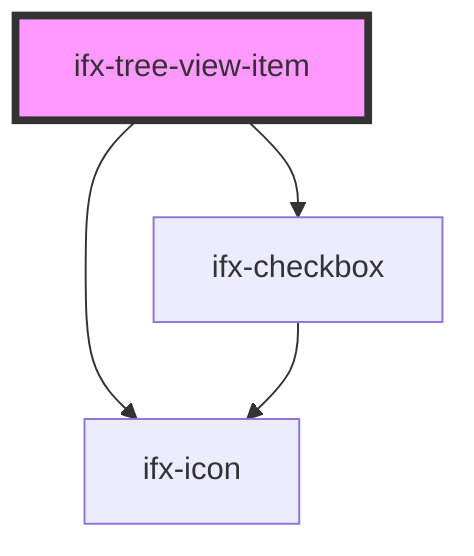

# ifx-tree-view-item

<!-- Auto Generated Below -->

## Properties

| Property            | Attribute            | Description                                                        | Type      | Default     |
| ------------------- | -------------------- | ------------------------------------------------------------------ | --------- | ----------- |
| `ariaLabelText`     | `aria-label-text`    | Accessible label for this tree item.                               | `string`  | `undefined` |
| `disableItem`       | `disable-item`       | If true, the item is disabled and not interactive.                 | `boolean` | `false`     |
| `expanded`          | `expanded`           | Whether this tree item is currently expanded (shows its children). | `boolean` | `false`     |
| `initiallyExpanded` | `initially-expanded` | If true, the item starts in an expanded state.                     | `boolean` | `false`     |
| `initiallySelected` | `initially-selected` | If true, the item starts in a selected/checked state.              | `boolean` | `false`     |
| `value`             | `value`              | Value associated with this tree item.                              | `string`  | `undefined` |

## Events

| Event                          | Description                                                    | Type                                      |
| ------------------------------ | -------------------------------------------------------------- | ----------------------------------------- |
| `ifxTreeViewItemCheckChange`   | Fired when the checked / selected state of the item changes.   | `CustomEvent<TreeViewCheckChangeEvent>`   |
| `ifxTreeViewItemDisableChange` | Fired when the disabled state of the item changes.             | `CustomEvent<TreeViewDisableChangeEvent>` |
| `ifxTreeViewItemExpandChange`  | Fired when the expanded / collapsed state of the item changes. | `CustomEvent<TreeViewExpandChangeEvent>`  |

## Dependencies

### Depends on

- [ifx-checkbox](../checkbox)
- [ifx-icon](../icon)

### Graph

```mermaid
graph TD;
  ifx-tree-view-item --> ifx-checkbox
  ifx-tree-view-item --> ifx-icon
  ifx-checkbox --> ifx-icon
  style ifx-tree-view-item fill:#f9f,stroke:#333,stroke-width:4px
```

----------------------------------------------

*Built with [StencilJS](https://stenciljs.com/)*
