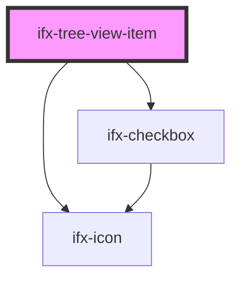

# ifx-tree-view-item

<!-- Auto Generated Below -->

## Properties

| Property            | Attribute            | Description | Type      | Default     |
| ------------------- | -------------------- | ----------- | --------- | ----------- |
| `ariaLabel`         | `aria-label`         |             | `string`  | `undefined` |
| `disableItem`       | `disable-item`       |             | `boolean` | `false`     |
| `expanded`          | `expanded`           |             | `boolean` | `false`     |
| `initiallyExpanded` | `initially-expanded` |             | `boolean` | `false`     |
| `initiallySelected` | `initially-selected` |             | `boolean` | `false`     |
| `value`             | `value`              |             | `string`  | `undefined` |

## Events

| Event                          | Description | Type                                      |
| ------------------------------ | ----------- | ----------------------------------------- |
| `ifxTreeViewItemCheckChange`   |             | `CustomEvent<TreeViewCheckChangeEvent>`   |
| `ifxTreeViewItemDisableChange` |             | `CustomEvent<TreeViewDisableChangeEvent>` |
| `ifxTreeViewItemExpandChange`  |             | `CustomEvent<TreeViewExpandChangeEvent>`  |

## Dependencies

### Depends on

- [ifx-checkbox](../checkbox)
- [ifx-icon](../icon)

### Graph

----------------------------------------------

*Built with [StencilJS](https://stenciljs.com/)*
