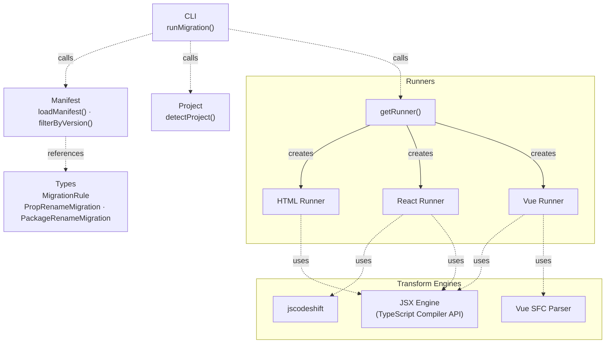
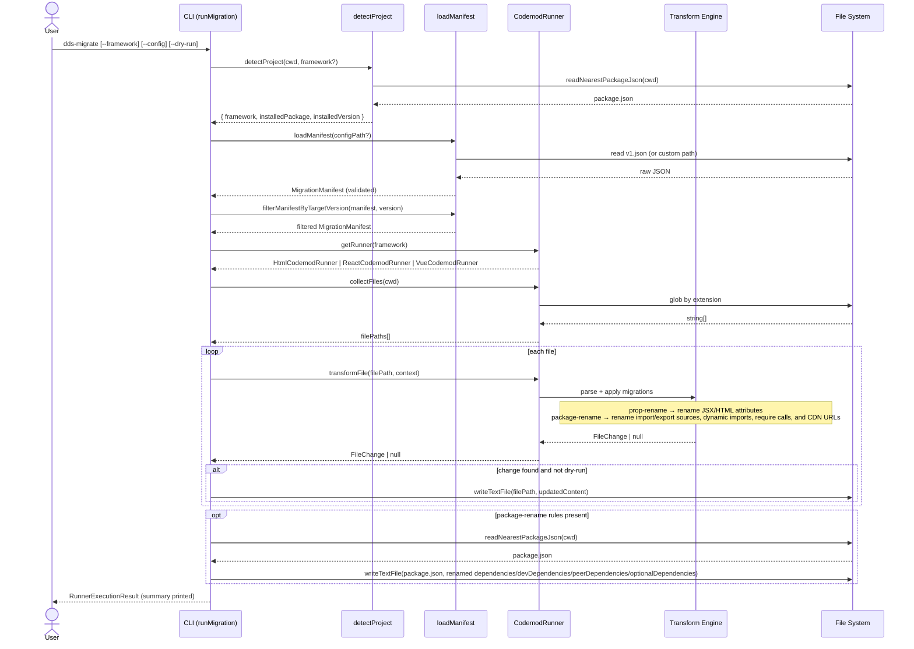

# migrations — Architecture

## Building Blocks

```mermaid
flowchart TD
    CLI["CLI\nrunMigration()"]
    Manifest["Manifest\nloadManifest() · filterByVersion()"]
    Project["Project\ndetectProject()"]
    Types["Types\nMigrationRule\nPropRenameMigration · PackageRenameMigration"]

    subgraph runners["Runners"]
        RunnerIndex["getRunner()"]
        HTML["HTML Runner"]
        React["React Runner"]
        Vue["Vue Runner"]
    end

    subgraph engines["Transform Engines"]
        JSX["JSX Engine\n(TypeScript Compiler API)"]
        Jscodeshift["jscodeshift"]
        VueSFC["Vue SFC Parser"]
    end

    CLI -.->|calls| Manifest
    CLI -.->|calls| Project
    CLI -.->|calls| RunnerIndex

    RunnerIndex -->|creates| HTML
    RunnerIndex -->|creates| React
    RunnerIndex -->|creates| Vue

    HTML -.->|uses| JSX
    Vue  -.->|uses| JSX
    Vue  -.->|uses| VueSFC
    React -.->|uses| Jscodeshift
    React -.->|uses| JSX

    Manifest -.->|references| Types
```

## Execution Sequence

```mermaid
sequenceDiagram
  actor User
  participant CLI as CLI (runMigration)
  participant Project as detectProject
  participant Manifest as loadManifest
  participant Runner as CodemodRunner
  participant Engine as Transform Engine
  participant FS as File System

  User->>CLI: dds-migrate [--framework] [--config] [--dry-run]

  CLI->>Project: detectProject(cwd, framework?)
  Project->>FS: readNearestPackageJson(cwd)
  FS-->>Project: package.json
  Project-->>CLI: { framework, installedPackage, installedVersion }

  CLI->>Manifest: loadManifest(configPath?)
  Manifest->>FS: read v1.json (or custom path)
  FS-->>Manifest: raw JSON
  Manifest-->>CLI: MigrationManifest (validated)

  CLI->>Manifest: filterManifestByTargetVersion(manifest, version)
  Manifest-->>CLI: filtered MigrationManifest

  CLI->>Runner: getRunner(framework)
  Runner-->>CLI: HtmlCodemodRunner | ReactCodemodRunner | VueCodemodRunner

  CLI->>Runner: collectFiles(cwd)
  Runner->>FS: glob by extension
  FS-->>Runner: string[]
  Runner-->>CLI: filePaths[]

  loop each file
    CLI->>Runner: transformFile(filePath, context)
    Runner->>Engine: parse + apply migrations
    Note over Engine: prop-rename → rename JSX/HTML attributes<br/>package-rename → rename import/export sources, dynamic imports, require calls, and CDN URLs
    Engine-->>Runner: FileChange | null
    Runner-->>CLI: FileChange | null

    alt change found and not dry-run
      CLI->>FS: writeTextFile(filePath, updatedContent)
    end
  end

  opt package-rename rules present
    CLI->>FS: readNearestPackageJson(cwd)
    FS-->>CLI: package.json
    CLI->>FS: writeTextFile(package.json, renamed dependencies/devDependencies/peerDependencies/optionalDependencies)
  end

  CLI-->>User: RunnerExecutionResult (summary printed)
```
