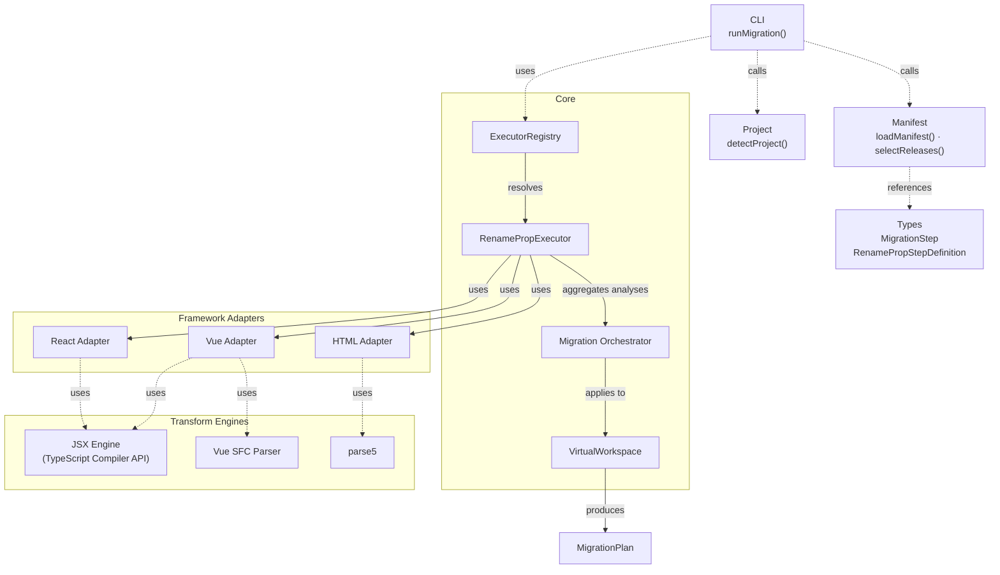
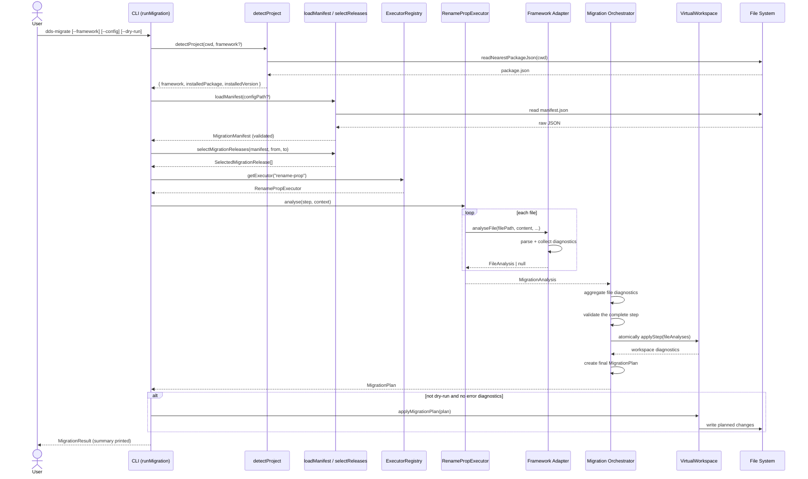

# migrations — Architecture

## Execution flow

```text
operation 1
↓
analyse currentContent
↓
apply validated TextEdits to workspace
↓
operation 2 analyses projected currentContent
↓
...
↓
final MigrationPlan
↓
disk write
```

The CLI follows an analyse-before-write discipline: a full `MigrationPlan` is
built before any file is written. Each step is executed by a registered operation
executor, which delegates to a framework adapter for file analysis. Adapters
return `FileAnalysis` objects containing `TextEdit`s and diagnostics. The
executor aggregates adapter analyses into a step analysis; the migration
orchestrator validates the complete step diagnostics and asks the virtual
workspace to atomically apply accepted file analyses. Only then is the plan
finalised.

### Atomicity boundaries

**Within a step:** all `FileAnalysis` results are validated before any workspace
`currentContent` is updated. Either all edits for the step are committed or none
are.

**Across the migration:** the disk is untouched until all selected operations
have completed without blocking diagnostics. The plan is applied as a single
batch write at the end.

## Building Blocks



## Responsibility split

- **Adapter** (`ReactRenamePropAdapter`, `VueRenamePropAdapter`,
  `HtmlRenamePropAdapter`): parses a single file and produces a `FileAnalysis`
  with text edits and diagnostics. It decides what is safe to rewrite within the
  file but does not know about other files or the final write plan.
- **Executor** (`RenamePropExecutor`): runs one migration operation across all
  files in the project by invoking the appropriate adapter for each file. It
  returns a `MigrationAnalysis` that aggregates all file analyses for that step.
- **Orchestrator** (`analyseMigration`): validates the complete step diagnostics
  and decides whether the step can be applied. It owns the lifecycle decision:
  warnings are accepted, errors stop execution before the next release step.
- **Virtual workspace** (`VirtualWorkspace`): receives accepted file analyses,
  validates and applies their `TextEdit`s atomically per step, and maintains
  `originalContent` and `currentContent` for composition across operations.
- **Plan application** (`applyMigrationPlan`): performs the final disk writes
  from the accumulated `MigrationPlan` when no error diagnostics are present.

## Execution Sequence


