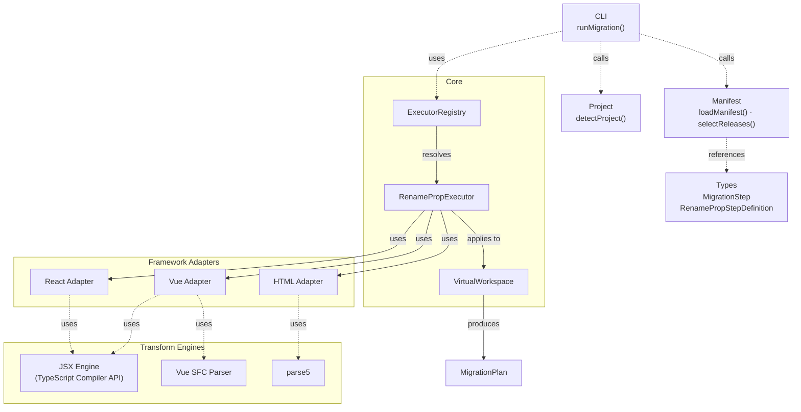
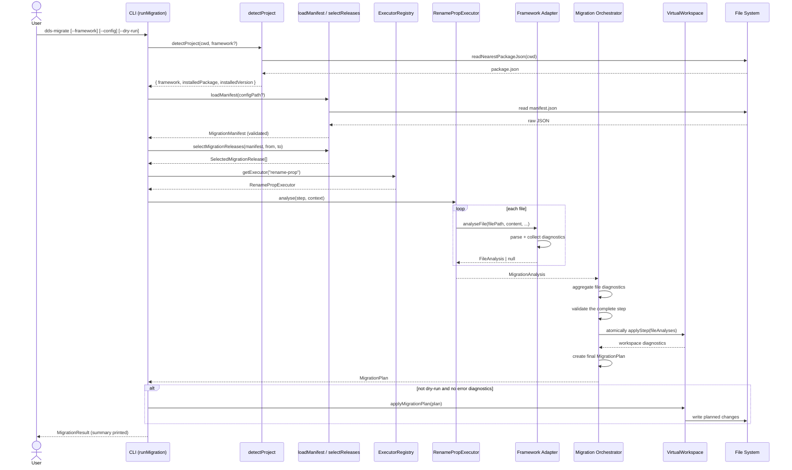

# migrations — Architecture

## Execution flow

```text
CLI
→ project/version resolution
→ manifest and release selection
→ executor registry
→ operation executor
→ framework adapter
→ virtual workspace
→ migration plan
→ apply
```

The CLI builds a full `MigrationPlan` before any file is written. Each step is
executed by a registered operation executor, which delegates to a framework
adapter for file analysis. Adapters return `FileAnalysis` objects containing text
edits and diagnostics. The virtual workspace collects these analyses, detects
conflicts, and only then applies the plan.

## Building Blocks



## Execution Sequence


