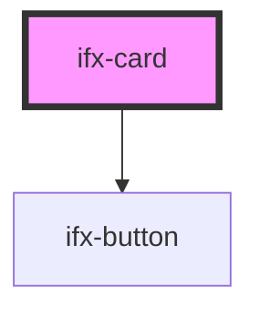

# ifx-card

<!-- Auto Generated Below -->

## Properties

| Property   | Attribute  | Description | Type      | Default     |
| ---------- | ---------- | ----------- | --------- | ----------- |
| `button`   | `button`   |             | `boolean` | `undefined` |
| `headline` | `headline` |             | `string`  | `undefined` |
| `list`     | `list`     |             | `boolean` | `undefined` |
| `skyline`  | `skyline`  |             | `boolean` | `undefined` |
| `text`     | `text`     |             | `string`  | `undefined` |

## Dependencies

### Depends on

- [ifx-button](../button)

### Graph

----------------------------------------------

*Built with [StencilJS](https://stenciljs.com/)*
