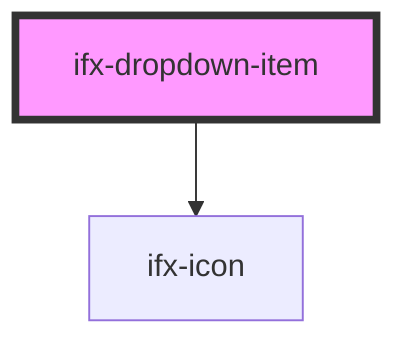

# ifx-dropdown-item

<!-- Auto Generated Below -->

## Properties

| Property    | Attribute   | Description | Type         | Default     |
| ----------- | ----------- | ----------- | ------------ | ----------- |
| `checkable` | `checkable` |             | `boolean`    | `false`     |
| `disabled`  | `disabled`  |             | `boolean`    | `undefined` |
| `icon`      | `icon`      |             | `boolean`    | `false`     |
| `label`     | `label`     |             | `string`     | `undefined` |
| `size`      | `size`      |             | `"m" \| "s"` | `undefined` |

## Dependencies

### Depends on

- [ifx-icon](../..)

### Graph

----------------------------------------------

*Built with [StencilJS](https://stenciljs.com/)*
