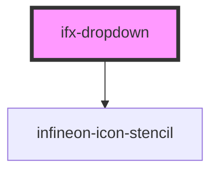

# ifx-dropdown

<!-- Auto Generated Below -->

## Properties

| Property   | Attribute  | Description | Type         | Default     |
| ---------- | ---------- | ----------- | ------------ | ----------- |
| `disabled` | `disabled` |             | `boolean`    | `undefined` |
| `icon`     | `icon`     |             | `boolean`    | `false`     |
| `label`    | `label`    |             | `string`     | `undefined` |
| `search`   | `search`   |             | `boolean`    | `false`     |
| `size`     | `size`     |             | `"m" \| "s"` | `undefined` |

## Dependencies

### Depends on

- [infineon-icon-stencil](../..)

### Graph

----------------------------------------------

*Built with [StencilJS](https://stenciljs.com/)*
