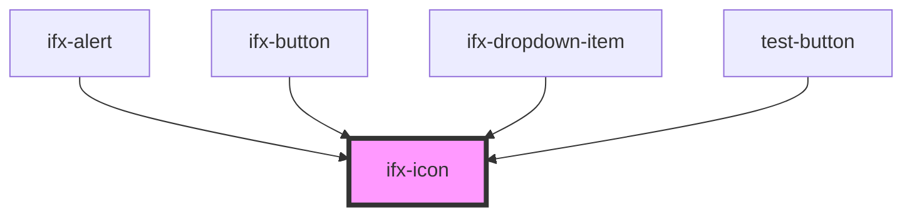

# ifx-icon

<!-- Auto Generated Below -->

## Properties

| Property  | Attribute  | Description | Type  | Default     |
| --------- | ---------- | ----------- | ----- | ----------- |
| `icon`    | `icon`     |             | `any` | `undefined` |
| `ifxIcon` | `ifx-icon` |             | `any` | `undefined` |

## Dependencies

### Used by

 - [ifx-alert](../alert)
 - [ifx-button](../button)
 - [ifx-dropdown-item](../dropdown-item)
 - [test-button](../mdx)

### Graph

----------------------------------------------

*Built with [StencilJS](https://stenciljs.com/)*
