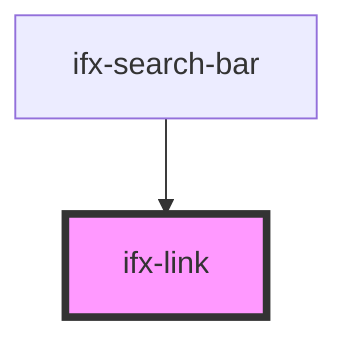

# ifx-link

<!-- Auto Generated Below -->

## Properties

| Property    | Attribute   | Description | Type      | Default     |
| ----------- | ----------- | ----------- | --------- | ----------- |
| `bold`      | `bold`      |             | `boolean` | `true`      |
| `color`     | `color`     |             | `string`  | `'black'`   |
| `href`      | `href`      |             | `string`  | `undefined` |
| `target`    | `target`    |             | `string`  | `'_self'`   |
| `underline` | `underline` |             | `any`     | `""`        |

## Dependencies

### Used by

 - [ifx-search-bar](../search-bar)

### Graph

----------------------------------------------

*Built with [StencilJS](https://stenciljs.com/)*
