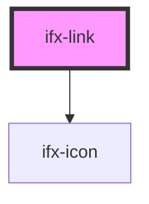

# ifx-link

<!-- Auto Generated Below -->

## Properties

| Property    | Attribute   | Description | Type     | Default     |
| ----------- | ----------- | ----------- | -------- | ----------- |
| `href`      | `href`      |             | `string` | `undefined` |
| `icon`      | `icon`      |             | `any`    | `""`        |
| `position`  | `position`  |             | `string` | `'right'`   |
| `target`    | `target`    |             | `string` | `'_self'`   |
| `underline` | `underline` |             | `any`    | `""`        |

## Dependencies

### Depends on

- [ifx-icon](../icon)

### Graph

----------------------------------------------

*Built with [StencilJS](https://stenciljs.com/)*
